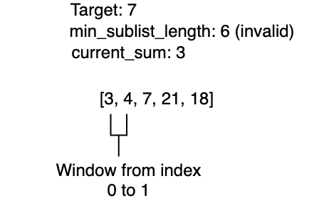

# Problem Solving

<iframe src="https://adaacademy.hosted.panopto.com/Panopto/Pages/Embed.aspx?pid=0471a830-aa32-4937-bb42-ae4c0144813e&autoplay=false&offerviewer=true&showtitle=true&showbrand=true&captions=true&interactivity=all" height="405" width="720" style="border: 1px solid #464646;" allowfullscreen allow="autoplay"></iframe>

## Learning Objectives

By the end of this lesson we should be able to:

* Approach a coding problem with systematic steps

## Introduction

We have all felt it.  We sit down in front of a programming problem and... do not know what to do...  How do we approach solving a new, knotty problem?  This lesson describes  a systematic approach to problem solving.  We should notice a similarity to Problem Solving Exercises in the classroom component of Ada.  In followup lessons we will then practice using Big-O notation to compare multiple approaches to the same problem.

## Vocabulary and Synonyms


Vocab | Definition | Synonyms | How to Use in a Sentence
:-----:|:-----:|:-----:|:-----:
Nominal Case | A "normal" or typical input to an application. | "normal" or "typical" | I used `x=5` as the nominal case.
Edge Case | An input that is outside the normal range of inputs. | "edge" or "extreme" | I used `x=0` as an edge case.
User Story | User stories are a technique to gather gather requirements written by or for users or customers to influence the functionality of the system being developed. | Acceptance criteria | My first user story is, "As a merchant, I can submit a form to create a new product on the store."

## Steps in Problem Solving

When we look at programming problems, either interview problems, or challenges encountered on the job, we can approach the task systematically.  We will examine one particular strategy which involves first trying to ensure we understand the problem, then breaking down the larger problem into smaller, more approachable steps, solving each one in turn.  Then we will examine our solution, evaluate how effective it is and attempt to improve upon it.

Our steps are:

* Understand the problem
* Explore Examples
* Break Down the Problem
* Solve or Reduce the Problem
* Simplify/Refactor

These steps are adapted from [George Pólya](https://en.wikipedia.org/wiki/George_P%C3%B3lya) a 20th century mathematician who wrote a book called [How to solve it](https://www.amazon.com/How-Solve-Aspect-Mathematical-Method/dp/4871878309/ref=sr_1_2?crid=GU4MZKCBYBLU&keywords=How+to+solve+George+P%C3%B3lya&qid=1643750753&sprefix=how+to+solve+george+p%C3%B3lya%2Caps%2C117&sr=8-2) about how to go about solving math problems.

## Sample Problem

We will walk through the steps of solving a problem using the following sample problem:

*Write a function called `minimum_sub_list_length` that takes in a list of positive 
numbers and a positive integer.*  

*It should return the minimum length of a contiguous sublist of the given input 
list which adds up to the given integer.*

## Understand The Problem

When we look at a given problem we need to understand what our code is expected to do.  Without solid understanding of our requirements we might write code which does not fully address the problem or even write a solution to a different problem entirely!

### User Stories

With an industry problem, this may involve talking to "customers," which could be company clients, or members of our or another team which will use the code.  It could also involve talking through requirements with the team or a product manager.  This typically involves writing [*user stories*](https://www.atlassian.com/agile/project-management/user-stories) which are a set of requirements for a given problem.  These user stories are often written in a language called *use case* which is a set of requirements for a given use case.  

For example, a user story might be:

* As a user, I want to be able to click on a button to add a new item to my shopping cart in order to assemble an order.

Typically user stories are written in the template:  

* As a `<type of end user>` I want to be able to `<some sort of action>` in order to `<some kind of outcome>`.  

This may also include a longer-term goal such as the above assembling of an order.

**Why do we need user stories?**

These user stories allow us to assemble requirements to meet the needs of the end user and ensure that we know what our code must do focusing on end-user needs.

### Interview Problems

In an interview problem like the above, we need to carefully examine the question and ask the interviewer followup questions to make sure we understand what is expected.

In this interview problem we can examine the language and figure out that we need to:

* Write a function named `minimum_sub_list_length`
* The function should take in a list of positive numbers and an integer as parameters
* The function should find the smallest length of a contiguous sublist of the given list which adds up to the given integer

The 1st two points are clear, but the third is a little more tricky.  We need to understand some of the terminology used in the problem.  Using Google or your own knowledge answer the following.

### !challenge

* type: paragraph
* id: f0a7b426-d097-4ae6-a25a-2a0567ef46d9
* title: What do sublist and contiguous mean?

##### !question

Explain the meaning of the following terms:

* contiguous
* sublist

Feel free to look up the terms in [Google](https://www.google.com/) or use other resources.

##### !end-question

##### !placeholder


##### !end-placeholder

##### !explanation

* contiguous: Elements of an array/list are contiguous if they are adjacent to each other in the list and maintain the same order.
* sublist: A list is a sublist of another list if all the elements of the first list are contained in the second list.

##### !end-explanation

### !end-challenge


### Our Understanding

So in this problem we need to write a function `minimum_sub_list_length` which takes in a list and an integer as parameters and will return the smallest number of contiguous elements, elements adjacent to one another, in the list which add up to the given integer.

## Explore Example Input/Output

Next to ensure we understand the problem we need to develop example inputs and determine what the output *should* be for those given inputs.  In industry this might involve drawing up mock-ups of the program and running through scenarios, or asking a customer or a team member to do so.  It could also involve generating sample input data and determining what the output should be.

In general it's most helpful to develop a few examples which will test the bounaries of what is possible for input.  These are called *edge-cases*.

We should consider:

* **Nominal Cases**
  * In this example we could give a list and number which does contain a contiguous sublist which adds up to the given number.
  * For example:  [1, 2, 3, 4] and 7 would return 2 because [3, 4] adds up to 7.
* **Negative Edge Case**
  * In this example we can give a list and a number in which the list does **not** contain a contiguous sublist which adds up to the given number.
    * For example: [1, 2, 3, 4] and 11 would need to return *something* to indicate that there is no contiguous sublist which adds up to the given number.
  * Another Negative Edge Case input would include an array of numbers all larger than the given positive integer.
    * For example: [6, 7] and 5 would return *something* to indicate there is no contiguous sublist which adds up to the given number.
  * Yet another negative edge-case would consist of an empty list.
* **Positive Edge Case**
  * This would be an input on the edge of what is possible which returns a valid length of a contiguous sublist.
  * For example: [1] and 1 would return 1 because [1] is a contiguous sublist which adds up to 1.

### Hey We Found a Problem!

By looking at concrete sample input and output examples, we can see that our problem is not as simple as it seems.  We need to consider cases when the list does not contain a contiguous sublist which adds up to the given number.  We also need to consider cases when the list is empty or contains only one element.

These make **excellent** test cases to use when developing and verifying our code.

For our purposes we will expect the function to return `None` if there is no contiguous sublist which adds up to the given number.  

## Break Down the Problem

Big massive problems are *hard*.  As developers we often find it easier to break down the problem into smaller, easier to understand steps.  This also helps us make an application more modular, testable and maintainable.  Clearly not all problems need to be broken up, but most substantial problems in interviews and in the workplace do.

In industry teams will often break the user stories into features and then break down those features into more modular components. This is called *modularizing* the application.

How could you break up our sample problem?  Answer and then check the explanation below.

### !challenge

* type: paragraph
* id: 819220a4-080c-4818-a984-29766400d819
* title: What subproblems do you see?

##### !question

How would you break down the problem into two subproblems?

##### !end-question

##### !placeholder

Subproblems

##### !end-placeholder

##### !explanation

Two subproblems could be:

1.  Determining the sum of a contiguous sublist
1.  Traversing the list to find the shortest contiguous sublist which sums to the given number

##### !end-explanation

### !end-challenge

### Solve or Reduce the Problem

Once a problem is understood and broken into more manageable pieces we can then solve the problem.

Write your solution and then look below to see a sample solution.

### !challenge

* type: code-snippet
* language: python3.6
* id: 28bb873d-ec9b-4158-87ba-b466e382749e
* title: Smallest Contiguous Sublist Problem
* points: 1
* topics: python, lists, sliding-window

##### !question

Write a function called `minimum_sub_list_length` that takes in a list of positive numbers, `numbers` and a positive integer, `target`.

It should return the minimal length of a contiguous sublist of the given input list which adds up to the given integer.

##### !end-question

##### !placeholder

```py
def minimum_sub_list_length(numbers, target):
    '''
    INPUT: list of positive numbers, and target a positive integer
    OUTPUT: the minimal length of a contiguous sublist of the given input list which adds up to the given integer.
    Return the length of the smallest contiguous sublist which adds up to the given integer or 
    return None if there is no such sublist.
    '''

```

##### !end-placeholder

##### !tests

```py
import unittest
from main import *

class TestChallenge(unittest.TestCase):
    def test_with_empty_list_and_42(self):
        self.assertEqual(None,minimum_sub_list_length([], 42))

    def test_with_one_element_list_and_number_equal_to_the_element(self):
        self.assertEqual(1,minimum_sub_list_length([12], 12))

    def test_with_one_element_list_and_number__not_equal_to_the_element(self):
        self.assertEqual(None,minimum_sub_list_length([12], 42))

    def test_with_1_2_3_4_and_target_7(self):
        self.assertEqual(2,minimum_sub_list_length([1, 2, 3, 4], 7))

    def test_with_4_3_2_1_and_target_7(self):
        self.assertEqual(2,minimum_sub_list_length([4, 3, 2, 1], 7))

    def test_with_1_2_3_4_and_target_10(self):
        self.assertEqual(4,minimum_sub_list_length([1, 2, 3, 4], 10))

    def test_with_1_3_4_and_target_5(self):
        self.assertEqual(2,minimum_sub_list_length([1, 3, 4], 7))

    def test_with_1_2_3_4_5_and_target_5(self):
        self.assertEqual(1,minimum_sub_list_length([1, 2, 3, 4, 5], 5))
```

##### !end-tests

<!-- other optional sections -->
<!-- !hint - !end-hint (markdown, hidden, students click to view) -->
<!-- !rubric - !end-rubric (markdown, instructors can see while scoring a checkpoint) -->
##### !explanation

A sample solution could be:

```py
def minimum_sub_list_length(numbers, target):
    '''
    INPUT: list of positive numbers, and target a positive integer
    OUTPUT: the minimal length of a contiguous sublist of the given input list which adds up to the given integer.
    Return the length of the smallest contiguous sublist which adds up to the given integer or 
    return None if there is no such sublist.
    '''
    if target == 0:
        return 0
    
    min_length = len(numbers) + 1
  
    for index in range(0, len(numbers)):
        current_sum = numbers[index]
        current_index = index + 1
        while current_index < len(numbers) and \
                current_sum + numbers[current_index] <= target:
            current_sum += numbers[current_index]
            current_index += 1
        
        if current_sum == target and current_index - index < min_length:
            min_length = current_index - index
    
    if min_length == len(numbers) + 1:
        return None
    
    return min_length
```


##### !end-explanation

### !end-challenge

<details style="max-width: 700px; margin: auto;">
  <summary>Click here to see a sample solution</summary>

  The solution below works, but as we will see later below, it is not optimal.  We can do better.

  ```py
  def minimum_sub_list_length(numbers, target):
    '''
    INPUT: list of positive numbers, and target a positive integer
    OUTPUT: the minimal length of a contiguous sublist of the given input list which adds up to the given integer.
    Return the length of the smallest contiguous sublist which adds up to the given integer or 
    return None if there is no such sublist.
    '''
    if target == 0:
        return 0
    
    min_length = len(numbers) + 1
  
    for index in range(0, len(numbers)):
        current_sum = numbers[index]
        current_index = index + 1
        while current_index < len(numbers) and \
                current_sum + numbers[current_index] <= target:
            current_sum += numbers[current_index]
            current_index += 1
        
        if current_sum == target and current_index - index < min_length:
            min_length = current_index - index
    
    if min_length == len(numbers) + 1:
        return None
    
    return min_length
  ```
</details>

This solution works and is a relatively direct straight forward approach. This is often called a "brute force" solution.

## Simplify/Refactor

The first big challenge in software development is to **produce working code**. After code is working however the time comes to simplify or refactor (improve) the solution.

In the sample solution above we are using a nested loop and the loop repeatably traverses the list. Our code is not time efficient because we examine the same elements of the list repeatedly.

We are only interested in contiguous sublists, elements have to be next to one another. This means we can apply a technique called a [sliding window](https://www.geeksforgeeks.org/window-sliding-technique/).  A sliding window is a technique that creates a contiguous sublist of a the larger list and then iterates through adjusting the start and end indicies of the sublist.  So each iteration either the start index moves forward or the end index moves forward allowing us to have a "sliding" sublist that progresses through the original list.

In this technique we slide a "window" across the list and track the sum of the elements within the window.  If the sum of the elements in the window is equal to the target, we have found a contiguous sublist.  

The image below illustrates the sliding window technique.



*Fig. Sliding Window*

### Implementing Our Refactor

In our refactor we can start by creating a window of size 1 from index 0 to index 1.  So our window's `start_index` is `0` and `end_index` is `1`. Our current sum then is the value of the 1st element of the list.

We track the following values:

* `start_index` - Where our window starts
* `end_index` - Where our window ends
* `current_sum` - The sum of the elements in the current window
* `min_length` - The length of the smallest contiguous sublist found thus far.

Then we can repeat this algorithm:

1.  If the current sum is equal to the target, we have found a contiguous sublist which adds up to target, and if it is the smallest contiguous sublist we have found so far, we update the minimum length.
      * We can also advance the window by incrementing the `start_index` by one.
1.  If the current sum is greater than or equal to the target we can decrease the window size by adding one to the start index of the window.
1.  If the current sum is less than the target we can increase the window size by adding one to the end index of the window.
1.  We will repeat this algorithm until the end index has passed the end of the list.

**Practice**:  Go back to the exercise above and try to implement the refactor.  Spend no more than 15 minutes on it.

<details style="max-width: 700px; margin: auto;">
  <summary>Click here to see a sample solution</summary>

  ```py
  def minimum_sub_list_length(numbers, target):
    '''
    INPUT: list of positive numbers, and target a positive integer
    OUTPUT: the minimal length of a contiguous sublist of the given input list which adds up to the given integer.
    Return the length of the smallest contiguous sublist which adds up to the given integer or 
    return None if there is no such sublist.
    '''
    if len(numbers) == 0:
        return None
          
    start_index = 0
    end_index = 1
    current_sum = numbers[0]
    min_length_sublist = len(numbers) + 1
  
    while end_index < len(numbers) + 1:

        if current_sum == target:
            min_length_sublist = min(min_length_sublist, end_index - start_index)

            current_sum -= numbers[start_index]
            start_index += 1

        elif current_sum < target:
            if end_index < len(numbers):
                current_sum += numbers[end_index]
            end_index += 1
            
        elif current_sum > target:
            current_sum -= numbers[start_index]
            start_index += 1

    if min_length_sublist == len(numbers) + 1:
        return None
    return min_length_sublist
  ```
</details>

This solution now makes only one pass through the list, meaning as the input array grows, the solution will perform better compared to our original solution.

## Summary

In this lesson we have walked through a general approach to problem solving.  By breaking the approach into a set of steps we can systematically approach problems in computer science.

The steps we created are:

* Understand the problem
* Explore Examples
* Break Down the Problem
* Solve or Reduce the Problem
* Simplify/Refactor

By making problem solving a process we can reduce stress and improve our ability to work toward solutions.
