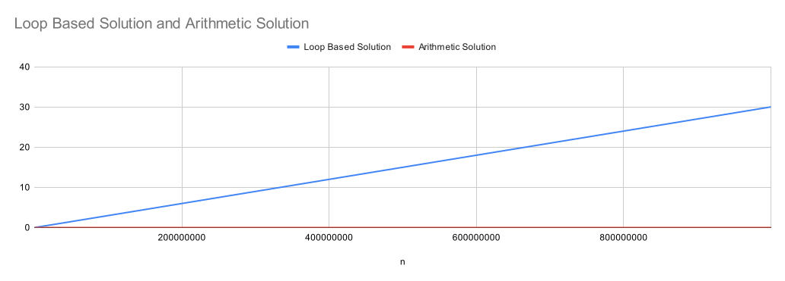
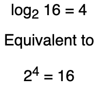
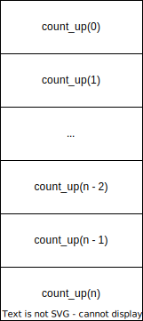

# Time & Space Complexity

<iframe src="https://adaacademy.hosted.panopto.com/Panopto/Pages/Embed.aspx?pid=248f1ada-b194-4dde-890c-ae4c01515260&autoplay=false&offerviewer=true&showtitle=true&showbrand=true&captions=true&interactivity=all" height="405" width="720" style="border: 1px solid #464646;" allowfullscreen allow="autoplay"></iframe>

## Learning Goals

By the end of this lesson we will be able to:

* Describe why we need Big O
* Define time and space complexity
* Evaluate the time & space complexity of a function
* Describe what a logorithm is

## Review of Big O Notation

Consider this problem:

```
Write a function to add up all the numbers from 1 to n.
```

We could solve the problem by iterating through the numbers from 1 to n and adding them all up.

*Code snippet: Using a loop*

```python
def add_from_1_to_n(n):
    total = 0
    for i in range(1, n + 1):
        total += i
    
    return total
```

Or we could do arithmetic to solve the problem:

*Code snippet: Using arithmetic*

```python
def add_from_1_to_n(n):
    return (n * (n + 1)) / 2
```

<details style="max-width: 700px; margin: auto;">
  <summary>How does the 2nd solution work?</summary>

  How does the 2nd solution work?

If we look at the loop based solution to the problem we can see that it will add up all the numbers from 1 to n.

1  +   2  +  3  + ...  + (n-1)  + n

We could rewrite it as:

n + (n-1) + ... +  3 +  2  + 1

So we could get twice the sum by adding both versions together:

```
   1    +    2    +    3    + ... + (n-1) + n
+  n    +  (n-1)  +  (n-2)  + ... +   2   + 1
----------------------------------------------
(n+1) + (n+1) + (n+1) + ... + (n+1) + (n+1)     <--- adding (n+1) n times

n * (n+1)
```

So `n * (n+1)` is twice the sum of all the numbers from 1 to n. Thus the answer is `(n * (n+1)) / 2`
</details>

It may seem clear that the second approach is better, but how does it perform compared to the 1st implementation?  We can use Big O notation to answer this question. Big O provides a precise language to describe how a function performs in terms of time the algorithm takes and memory used during execution.

Generally when we evaluate an algorithm, or solution to a problem, we look at in in terms of:

* How long does it take to run
* How much memory does it take to run
* How maintainable is the code
  * Can it be tested throughly
  * Can it be read easily

The third criteria is often the most important. Development time is important and expensive,  however sometimes in mission critical application bottlenecks how fast an algorithm runs or memory consumption can be very important.

## Evaluating Time & Space Complexity

So both functions calculate the same answer, but how do we judge which is better? Both use similar amounts of memory as both only create a limited number of integer variables, no lists or dictionaries. The loop-based solution is easier to understand for anyone who has not worked through the arithmetic solution.

However the arithmetic solution will run faster as it does not require a loop which performs `n` additions. However how much better is it?

If we timed our code we could observe how long it takes to run.

|  n 	|  Loop-based solution 	|  Arithmetic solution 	|
|---	|---	|---    |
|   1000000	| 0.036s  	| ~0s      |
|   10000000	|   0.30s	|  ~0s     |
|   10000000	|   2.99s	|  ~0s     |
|   10000000	|   30.03s	|  ~0s     |


Looking at the timing results of the two functions we can see that the arithmetic solution is *much* faster. This is because the arithmetic solution performs much fewer operations and the number of operations does not change when `n` becomes large. On the other hand the loop-based solution performs a coorespondingly larger number of operations as `n` increases. Notice that as `n` increased tenfold, the number of seconds it took to run the loop-based solution increased by an approximate factor of ten.



*Fig. Loop based vs arithmetic solution chart*

### Why Timing Our Code Is Not Enough

However timing our code, while helpful, is not enough. This is because:

* Other programs can be running while our code executes, making our measurements less accurate
* Computers vary in speed and accuracy, so the amount of time the program takes to run on one computer would be different from another.
* Other factors outside of our code timing results can vary between executions.

We could try to count the number of operations performed by our code, but high level languages often obscure the number of operations performed. For example, in Python the number of operations performed by a library function is not easily accessible. 

Instead as computer scientists we have developed Big O notation as a way to formalize a rough estimate of the number of how the number of operations *change* as the size of the input increases.

**Note:** We care about how the algorithm performance *changes* as the input size **increases**.

### Time Complexity

Thus enters the field of time complexity. Even inefficient algorithms can often perform well with small inputs. But as the size of the input `n` increases, the number of operations performed by the algorithm often increases. **We care about how the trend in the number of operations changes with the size of the input**. We also attempt to estimate the worst-case scenario for the number of operations. Big O provides a way to measure and discuss how the worst-case scenario for the number of operations changes with the size of the input.

* **Formal definition of Time Complexity:**
  * A theoretical measure of the execution of the time an algorithm needs, given the problem size n, which is usually the number of items.
  * Informally, saying some equation f(n) = O(g(n)) means that the actual runtime is less than some constant multiple of g(n). The notation is read, "f of n is big oh of g of n".

#### Constant Time Complexity

Some algorithms will take essentially the same amount of time regardless of the size of the input. A good example is our arithmetic solution from above. It takes the same amount of time regardless of the size of the input.

```py
def add_from_1_to_n(n):
    return (n * (n + 1)) / 2
```

So for these **constant time** algorithms we say the algorithm has a **constant time complexity** or `O(1)`.

#### Linear Time Complexity

On the other hand some algorithms will take an amount of time proportional to changes in the size of the input. A good example is our loop based function. If the input size doubles, the function will take roughly twice as long to run. 

```py
def add_from_1_to_n(n):
    total = 0
    for i in range(1, n + 1):
        total += i

    return total
```

This is called a **linear time complexity** or `O(n)`.

Notice that if we had an algorithm that printed all the numbers from 1 to n and then down from n to 1 it would take `O(n + n)` = `O(2n)` time to execute, but for Big O we drop any cooeficients or less significant terms. Thus `O(2n)` = `O(n)`.

```py
def count_up_and_down(n):
    # Takes n time to run
    for i in range(1, n + 1):
        print(i)
    
    # takes n time to run
    for i in range(n, 0, -1):
        print(i)
```

So the above function also has a **linear time complexity** or `O(n)`.

#### Quadratic Time Complexity

Often we will have a function which involves nested loops. For example the code below contains a for loop which runs n times and a loop nested inside which runs, worst-case, n-1 times.

```py
def minimum_sub_list_length(numbers, target):
    if target == 0:
        return 0
    
    min_length = len(numbers) + 1
  
    # loop runs n times
    for index in range(0, len(numbers)):
        current_sum = numbers[index]
        current_index = index + 1
        # nested loop runs, worst-case n-1 times
        while current_index < len(numbers) and \
                current_sum + numbers[current_index] <= target:
            current_sum += numbers[current_index]
            current_index += 1
        
        if current_sum == target and current_index - index < min_length:
            min_length = current_index - index
    
    if min_length == len(numbers) + 1:
        return None
    
    return min_length
```

When we encounter nested loops, we multiply the time complexity of the inner loop by the number of iterations of the outer loop. 

So in this case:

* If we multiply the number of iteration on the outer loop by the inner loop: `(n * (n-1))` = `(n^2 - n)`
* We can drop the less significant term `n` because `n^2` will dominate the result. 
* We end up with a time complexity of `O(n^2)`.

This is called a **quadratic time complexity** or `O(n^2)`.

#### Logorithms

Sometimes algorithms may produce time complexities more sophisticated than quadratic or linear. For example, the following function will take `O(log n)` time.

```py
def binary_search(test_array, value):
    low = 0
    high = len(test_array) - 1
    while low <= high:
        mid = (low + high)//2
        if test_array[mid] > value:
            high = mid - 1
        elif test_array[mid] < value:
            low = mid + 1
        else:
            return mid

        if test_array[low] == value:
            return low

    return None
```

**What is a log again**?

A logarithm is a quantity representing the power to which a fixed number (the base) must be raised to produce a given number. For example the log with base 2 of 8 is 3 (2^3 = 8)  The log of base 10 of 10000 is 4 (10^4 = 10000).

See below. 



In a coding problem if we reduce the size of a problem by dividing the remaining input with each iteration we often get a time complexity involving a logarithm.

Taking an [example from Stack Overflow](https://stackoverflow.com/questions/2307283/what-does-olog-n-mean-exactly/2307314#2307314), a physical example of a logathmic algorithm is:

```
Given a person's name, find the phone number by picking a random point 
about halfway through the part of the book you haven't searched yet, 
then checking to see whether the person's name is at that point. Then 
repeat the process about halfway through the part of the book where 
the person's name lies. (This is a binary search for a person's name.)
```

The classical example of a logarithmic problem is binary search:

```py
def mystery_function(numbers, value):
    low = 0
    high = len(numbers) - 1
    while low <= high:
        mid = (low + high)//2
        if numbers[mid] > value:
            high = mid - 1
        elif numbers[mid] < value:
            low = mid + 1
        else:
            return mid

        if numbers[low] == value:
            return low

    return None
```

If the input is eight elements [1, 2, 3, 4, 5, 6, 7, 8] and `value` is 2:

* In the first iteration `low` will be 0 and `high` would be 7, and  `mid` would be 3 ( (0+7) / 2).
* On the second iteration `low` remains 0 and `high` becomes 2 and `mid` becomes 1.
* Then value is found in the list and the function returns 1.

Notice with each iteration the size of the input involved in the search (`low` to `high`) is halved. So worst-case a list of 8 items would take 3 iterations to find the value. We could double the size of `numbers` to 16 items and it would only take 4 iteration to find the value and for 32 items it would only take 5 iterations. Thus while the function *does* take longer as the input size increases it does not increase very rapidly.

In the worst case scenario, the algorithm will take the following number of iterations given the input of size `n`:

|   n	|   Number of iterations	|
|---	|---	|
|   8	|   3	|
|   16	|   4	|
|   32	|   5	|
|   64	|   6	|

*Table. Number of iterations for each input size.*

In general:

* If the size of the input is *divided* by some value with each iteration, the time complexity involves a logarithm with a base equal to the divisor.
* By far, the most common logarithmic base is 2 because our algorithms often, like binary search, divide the input size by two with each iteration. 
  * Often we drop the base of the logarithm on the assumption that it is 2.
  * For Big-O notation, we do not need to indicate the base.

#### Other Time Complexities

We will occassionally encounter algorithms that have other time complexities. Later in the course we will encounter algorithms which have exponential and factorial time complexities. Algorithms with these time complexities run extremely slow at even moderate inputs and for large inputs are effectively useless.

[](https://www.bigocheatsheet.com/)

*Fig. From Big O Cheat Sheet*

### Space Complexity

Space complexity measures the amount of memory an algorithm uses as it runs. Sometimes it can be called *auxiliary space* or *extra space* required by the algorithm beyond the space required by the input. 

The rules with regard to space complexity are:

* Most single-value variables take up constant space.
  * booleans, numbers, floats, etc
  * Sometimes these are called *primitives*
* Strings take up O(n) space where n is the string length
* Lists take up O(n) space where n is the list length
* Dictionaries take up O(n) space where n is the number of key-value pairs

Consider the following function:

```py
def sum_up(numbers):
    total = 0
    for number in numbers:
        total += number

    return total
```

This function requires 2 numeric variables to store the total and the current number. We can say that the function requires 2 (i.e. *constant space*) to run or `O(1)`. The amount of memory used does not change as the length of `numbers` increases.

On the other hand the following function requires a list to store double all the numbers.

```py
def double_numbers(numbers):
    doubled = [num * 2 for num in numbers]

    return doubled
```

This function created a new list of numbers proportional in size to the input. So the space complexity is `O(n)`.

Now try to estimate time time complexity for the following function.

<!-- >>>>>>>>>>>>>>>>>>>>>> BEGIN CHALLENGE >>>>>>>>>>>>>>>>>>>>>> -->
<!-- Replace everything in square brackets [] and remove brackets  -->

### !challenge

* type: multiple-choice
* id: 8889dceb-5f2e-4192-9981-e8ce85fcf89e
* title: Estimate Space Complexity
* points: 1
* topics: python, space complexity

##### !question

What is the *space complexity* of the following function?

```py
def mystery_function(test_array, value):
    low = 0
    high = len(test_array) - 1
    while low <= high:
        mid = (low + high)//2
        if test_array[mid] > value:
            high = mid - 1
        elif test_array[mid] < value:
            low = mid + 1
        else:
            return mid

        if test_array[low] == value:
            return low

    return None
```

##### !end-question

##### !options

* O(1)
* O(log n)
* O(n)
* O(n^2)
* O(2^n)

##### !end-options

##### !answer

* O(1)

##### !end-answer

<!-- other optional sections -->
##### !hint

Is the function creating new lists or dictionaries?

##### !end-hint

##### !explanation

Because the function only creates 3 "primitive" variables no matter the size of the input list, the space complexity is `O(1)`.

##### !end-explanation

### !end-challenge

**Note on Recursion**

When we look at recursive functions, we also need to consider the call stack as part of the space complexity. For example the following function prints all the numbers from 1 to n, but because it makes another function call for each number from 1 to n, it requires `O(n)` space.

```py
def count_up(n):
    if n == 0:
        return
    
    count_up(n - 1)
    print(n)
```

This is because the Python interpreter needs to save every active function call on something called the *call stack* with all of it's local variables etc.



*Fig. Call stack diagram*

## Summary

Big O is a standard way to measure how much the time an algorithm takes and how much memory an algorithm requires to run as the input size increases. This allows us to compare different solutions to measure them against each other. Big O is helpful in selecting the proper algorithm to use for a problem.

Some general rules to use when thinking about time and space complexity:

* Constants do not matter so `O(27)` = `O(1)` and `O(3n)` = `O(n)`
* Smaller terms do not matter so `O(n + 27)` = `O(n)` and `O(n^2 + 3n + 3)` = `O(n^2)`.
* Arithmetic operations are constant `O(1)`
* Variable assignment is constant `O(1)`
* Accessing an element in an array or a value in a dictionary by the key is constant `O(1)`
* In a loop the time complexity is the length of the outer loop multiplied by the time complexity of the loop body

## Resources

* [Hackernoon What does the time complexity O(log n) actually mean?](https://hackernoon.com/what-does-the-time-complexity-o-log-n-actually-mean-45f94bb5bfbf)
* [Colt Steele Big O](https://cs.slides.com/colt_steele/big-o-notation)
* [Big O Cheat Sheet](https://www.bigocheatsheet.com/)