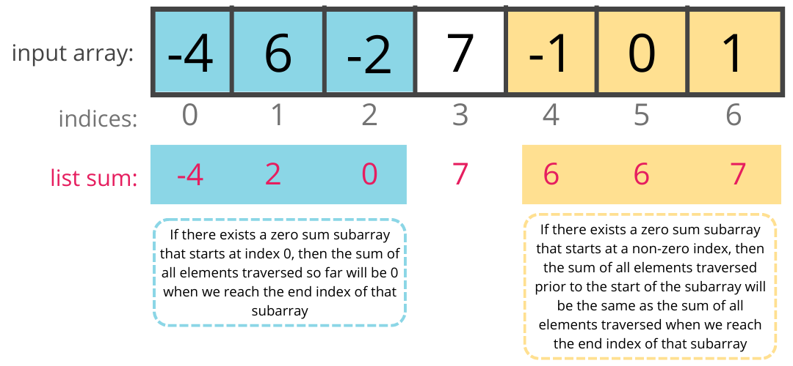
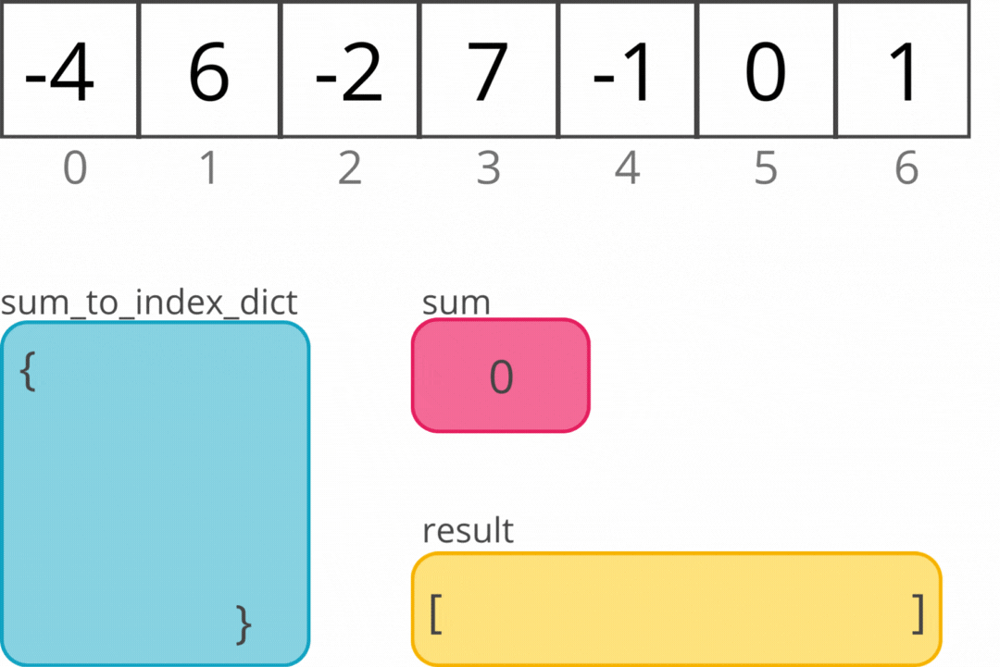

# Introduction to Algorithms

<iframe src="https://adaacademy.hosted.panopto.com/Panopto/Pages/Embed.aspx?id=2619c3c1-e6d5-48a1-a199-aad7014dcc4e&autoplay=false&offerviewer=true&showtitle=true&showbrand=false&start=0&interactivity=all" height="405" width="720" style="border: 1px solid #464646;" allowfullscreen allow="autoplay"></iframe>
<!--update video-->


**Note** This video lesson covers algorithms content as it was written for cohorts C16 and prior. Significant changes have been made, and the above videos do not fully align with the updated lesson content. However, they do provide a good general overview of divide and conquer, greedy, and dynamic programming for those who prefer video lessons.


## Learning Goals

By the end of this lesson you should be able to:

- Explain the term algorithm
- Further explain time and space complexity
- Further explain recursion
- Explain two categories of algorithms: _divide and conquer_ and _dynamic programming_


### !callout-danger

## How to Approach This Topic

This topic contains review on several topics previously covered in classroom. We recommend first doing a quick skim of each topic and completing each of the included exercises to refamiliarize yourself with the topic. 

After skimming all of the topics, go back and do a closer read of topics you need extra review on. Included in your re-review should be a close reading of dynamic programming.

### !end-callout

## Video Lesson


- [Slide Deck used for C16](https://docs.google.com/presentation/d/1V4ycrfl3dbL0IbRHqK3ytU45VyMJQNHhyxpc3Ti2e28/edit?usp=sharing)

## What is an Algorithm?

Before we can discuss different algorithmic strategies, we need to understand what an algorithm _is_.  An **algorithm** is a finite set of instructions that, if followed, accomplishes a particular task.  We can think of it as a series of steps to accomplish a task.  For example, Google Maps has an algorithm to calculate the best route to drive between any two points on a map.  

All algorithms must have:

- Input
  - An algorithm may accept zero or more inputs
- Output
  - An algorithm should produce some result
- Clarity
  - Each step in an algorithm should be a clear and unambiguous
- Finiteness
  - An algorithm should end after a finite number of steps. 
  - An algorithm cannot repeat forever (otherwise it doesn't solve a problem)
- Effectiveness
  - It should be possible for a person or computer to fulfill each step in an algorithm and the algorithm should accomplish the given task.

### Areas of Study

The study of computer science is the study of algorithms. At its core, computer science is really the art of devising, analyzing, proving the correctness of, and testing algorithms:

- **Devising** algorithms
  - This is the art of using data structures and design strategies to develop new and useful algorithms
  - It also encompasses optimizing and generalizing existing algorithms
- **Validating** algorithms
  - This is the art of proving the correctness of an algorithm for all possible inputs
  - This is very similar to a mathematical proof
- **Analyzing** algorithms
  - This is identifying the efficency of an algorithm using time and space complexity
- **Testing** algorithms
  - This is really debugging the algorithm  
  - When the algorithm is tested, it is run on sample data. If the tests produce unexpected output, the error causing the unexpected output needs to be debugged
  - Algorithms are also _profiled_ or assessed on their performance measurements by running the algorithm on sample data and measuring performance changes and memory usage.
    - For example [leetcode](https://leetcode.com/) takes your solution to a common programming problem and compares its performance to solutions from other developers

This course will focus on devising, analyzing, and, testing algorithms. We are choosing to focus on these three aspects because they are the skills most often evaluated during technical interviews for junior software developer roles. Validating algorithms is beyond the scope of this course, but feel free to follow your curiosity!

## Devising and Testing Algorithms
Devising algorithms is really just problem solving. So how do we approach solving a new, knotty problem? What steps can we take when we sit down in front of a programming and... have no idea what to do? This lesson describes a systematic approach to problem solving. Notice the similarity to Problem Solving Exercises in the classroom portion of Ada and their equivalent, Interview Practice Questions, in the Thursdays at Ada portion. In follow-up lessons, we will practice using Big-O notation to compare multiple approaches to the same problem.  


## Vocabulary and Synonyms

Vocab | Definition | Synonyms | How to Use in a Sentence
:-----:|:-----:|:-----:|:-----:
Nominal Case | A "normal" or typical input to an application. | normal case, typical case| I used `x=5` as the nominal case.
Edge Case | An input that is at the extreme of the allowable range of inputs. |extreme case| I used `x=0` as an edge case.


### Steps in Problem Solving

When we look at programming problems - either interview problems or challenges encountered on the job - we can approach the task systematically. Let's examine one particular strategy which involves first ensuring we understand the problem followed by breaking down the larger problem into smaller, more approachable steps and solving each step in turn. Then, we will examine our solution, evaluate how effective it is and attempt to improve upon it.

Our steps are:

* Understand the problem
* Explore Examples
* Break Down the Problem
* Solve or Reduce the Problem
* Simplify/Refactor

These steps are adapted from [George Pólya](https://en.wikipedia.org/wiki/George_P%C3%B3lya) a 20th century mathematician who wrote a book called [How to solve it](https://www.adasbooks.com/book/9780691164076) about how to go about solving math problems.

### Sample Problem

We will walk through the steps of solving a problem using the following sample problem:

*Write a function called `zero_sum_subarray` that takes in a list of integers.*  

*The function should return a 2D list where the outer list contains all contiguous subsequences within the given list that add up to zero.*

### Understand the Problem

When we look at a given problem we need to understand what our code is expected to do.  Without solid understanding of our requirements, we might write code which does not fully address the problem or even write a solution to a different problem entirely!

#### Interview Problems

In an interview problem like `zero_sum_subarray`, we need to carefully examine the question and ask the interviewer follow-up questions to make sure we understand what is expected.

In this interview problem we can examine the problem statement and figure out that we need to:

* Write a function named `zero_sum_subarray`
* The function should take in a list of integers
* The function should find all contiguous subsequences in the given list which add up to zero

The first two points are relatively clear, but the third is a little more tricky.  We need to understand some of the terminology used in the problem.  Using Google or your own knowledge answer the following.

### !challenge

* type: paragraph
* id: f0a7b426-d097-4ae6-a25a-2a0567ef46d9
* title: What do contiguous, subsequence, and 2D list mean?

##### !question

Explain the meaning of the following terms:

* contiguous
* subsequence
* 2D list

Feel free to look up the terms in [Google](https://www.google.com/) or use other resources.

##### !end-question

##### !placeholder


##### !end-placeholder

##### !explanation

* contiguous: Elements of an array/list are contiguous if they are *adjacent to each other in the list and maintain the exact same order*.
* subsequence: A sequence is a subset of a larger sequence in which all the elements of the subsequence are contained in the larger sequence in the *same relative order*. For example, if our larger sequence is the list `[1,2,3,4]`, a subsequence would be `[1,4]` because both `1` and `4` are in each of the two sequences and `1` comes before `4` in each list. `[4,1]` would not count as a subsequence because `1` precedes `4` in the larger list but `1` comes after `4` in the subsequence. Our sequence could also be a string, integer, or another linear series of data. 
* 2D list: A 2D list/2D array is a *list whose elements are all lists*. The containing list is often called the outer list and its elements are referred to as inner lists. Inner lists are often the same length but can also have different lengths.

##### !end-explanation

### !end-challenge

### !callout-info

## Contiguous Subsequence vs Subarray

A contiguous subsequence is also known as a [**subarray**](https://www.geeksforgeeks.org/subarraysubstring-vs-subsequence-and-programs-to-generate-them/)/sublist. Many interviewing problems use the terminology contiguous, subsequence, and/or subarray in the problem statement. 

### !end-callout

### !callout-star

## What if Google isn't allowed?

Ask your interviewer! While it may feel nervewracking to admit you are unfamiliar with a term (or multiple terms), asking for clarification can also signal that you are a clear communicator, collaborative, and detail-oriented.

### !end-callout

####  Summarizing Our Understanding

So in this problem we need to write a function `zero_sum_subarray` which takes in a list of integers as parameters and will return all the sublists whose elements add up to zero in an outer list.

### Explore Example Input/Output

Next to ensure we understand the problem we need to develop example inputs and determine what the output *should* be for those given inputs.  In industry this might involve drawing mock-ups of the program and running through scenarios or asking a customer or a team member to do so.  It could also involve generating sample input data and determining what the output should be.

While we want to ensure our algorithm will work on typical input or **nominal cases**, it is also very important to develop a few examples which will test the boundaries of what is possible for input.  These are called **edge cases**.

We should consider:
* **Nominal Case**
  * In this example we could give a list that contains two contiguous subsequences which add up to zero. 
  * For example: an input list of `[-4, 6, -2, 7, -1, 0, 1]` would return `[[-4,6,2], [-1,0,1], [0]]` because the elements of each of the following subarrays: `[-4,6,2]`, `[-1,0,1]`, and `[0]` all add up to zero.
* **Nominal Edge Case**
  * In this example we could give a list which contains exactly one contiguous subsequence which adds up to zero.
  * For example:  an input list of `[1, -1, 2, 4]` would return `[[1,-1]]` because `[1, -1]` adds up to 0.
* **Negative Edge Case**
  * In this example we could give a list and a number in which the list does **not** contain a contiguous subsequence which adds up to zero.
    * For example: an input list of `[1, 2, 3, 4]` would need to return *something* to indicate that there is no contiguous sublist which adds up to zero.
    * Another example: an input list of `[]` needs to return *something* to indicate there is no contiguous sublist which adds up to zero.
* **Positive Edge Case**
  * This would be an input on the edge of what is possible which returns a valid length of a contiguous sublist.
  * For example: the input `[0]` would return `[[0]]` because the entire input list (which can also be considered a subarray) is our target sum of zero.

By looking at concrete sample input and output examples, we can see that our problem is not as simple as it seems.  We need to consider cases when the list does not contain a contiguous sublist which adds up to zero.  We also need to consider cases when the list is empty or contains only one element.

For our purposes we will expect the function to return an empty list `[]` if there is no contiguous sublist which adds up to the given number. In an interview setting, consider asking your interviewer if there is a preferred return value when the algorithm encounteres the edge case scenearios. If there is no preferred return value, make a thoughtful decision about what the algorithm should return and communicate your choice to your interviewer.

<!-- available callout types: info, success, warning, danger, secondary, star  -->
### !callout-star

## Devising and Testing Go Hand in Hand

These sample inputs and outputs make **excellent** test cases to use when verifying the algorithm we devise. Creating tests for an algorithm is often an integral step in helping us devise our algorithm!

### !end-callout

### Break Down the Problem

Big massive problems are *hard*.  As developers it is often easier to break down the problem into smaller, easier to understand steps.  This also helps us make an application more modular, testable and maintainable.  Clearly not all problems need to be broken up, but most substantial problems in interviews and in the workplace do.

How could you break up our sample problem?  Answer and then check the explanation below.

### !challenge

* type: paragraph
* id: 819220a4-080c-4818-a984-29766400d819
* title: What subproblems do you see?

##### !question

How would you break down the problem into two or more subproblems?

##### !end-question

##### !placeholder

##### !end-placeholder
##### !hint
When you think about attempting to solve this problem, what about it seems difficult to you? Where are you getting stuck? 

Feeling stuck often means you've found a subproblem you need to solve!
##### !end-hint

##### !explanation

Sample subproblems could be:

1.  Finding all the contiguous subsequences.
2.  Determining if a single contiguous subsequence sums to zero.
3.  Traversing the list to find all the contiguous subseuquences which sum to zero.

##### !end-explanation

### !end-challenge

### Solve or Reduce the Problem

Once a problem is understood and broken into more manageable pieces we can then solve the problem.

Write your solution and then look below to see a sample solution.

### !challenge

* type: code-snippet
* language: python3.6
* id: 4dc81336-1c2d-421e-8fe8-27326736b2e3
* title: Smallest Contiguous Sublist Problem
* points: 1
* topics: python, lists, hash tables

##### !question

Write a function called `zero_sum_subarray` that takes in a list of integers numbers, `numbers`.

The function should return a 2D list where the outer list contains all contiguous subsequences within the given list that add up to zero. If there are no contiguous subsequences that add up to zero, return an empty list.

Spend no more than 20 minutes working through this independently. Use the hints below or reach out for help if you are still feeling stuck after 5 minutes.

##### !end-question

##### !placeholder

```py
def zero_sum_subarray(numbers):
    '''
    INPUT: list of integers
    OUTPUT: a 2D list where the outer list contains all contiguous subsequences within the given list that add up to zero. If there are no contiguous subsequences that add up to zero, return an empty list.
    '''

```

##### !end-placeholder

##### !tests

```py
import unittest
from main import *

class TestPython1(unittest.TestCase):
  def empty_list_returns_empty_list(self):
    self.assertEqual([],zero_sum_subarray([]))

  def test_list_with_only_zero_returns_zero(self):
    self.assertEqual([[0]],zero_sum_subarray([0]))

  def test_with_one_element_list_and_nonzero_number(self):
    self.assertEqual([],zero_sum_subarray([12]))

  def test_with_one_valid_subarray_length_greater_than_one(self):
    self.assertEqual([[1,-1]], zero_sum_subarray([1,-1,2,4]))

  def test_one_valid_subarray_nonzero_starting_index(self):
    self.assertEqual([[1,-1]], zero_sum_subarray([2, 1,-1, 4]))

  def test_nominal_example(self):
    result = zero_sum_subarray([-4,6,-2,7,-1,0,1])
    result.sort()
    self.assertEqual([[-4,6,-2],[-1,0,1],[0]], result)

  def test_with_duplicate_subarrays(self):
    result = zero_sum_subarray([7,-4,6,-2,1,-4,6,-2])
    self.assertEqual([[-4,6,-2],[-4,6,-2]], result)

  def test_no_subarray_with_zero_sum(self):
      self.assertEqual([],zero_sum_subarray([1, 2, 3, 4, 5]))
  
  def test_two_zeroes_in_a_row(self):
    result = zero_sum_subarray([-4,6,-2,7,-1,0, 0,1])
    result.sort()
    self.assertEqual([[-4,6,-2],[-1,0,0,1],[0], [0], [0,0]], result)
```

##### !end-tests

<!-- other optional sections -->
##### !hint 
Start by solving each subproblem. Then see if you combine the solutions to each subproblem to come up with an overall solution. 

Still feeling stuck? Try watching the video walkthrough of a sample solution below:
<!-- Insert video solution -->

##### !end-hint 
<!-- !rubric - !end-rubric (markdown, instructors can see while scoring a checkpoint) -->
##### !explanation

A sample solution could be:

```py
  def zero_sum_subarray(numbers):
    '''
    INPUT: list of integers
    OUTPUT: a 2D list where the outer list contains all contiguous subsequences within the given list that add up to zero. If there are no contiguous subsequences that add up to zero, return an empty list.
    '''
    # if the input list is empty
    if not numbers:
      # return an empty list
      return []
    
    # create an empty list to store all subarrays with a sum of zero
    subarrays = []

    # loop through the indices of the input list
    for i in range(len(numbers)):
      # initialize a list to hold the current subarray
      current_subarray = []
      # initialize an accumulator variable to track the sum of the current subarray
      subarray_sum = 0
      # loop through the indices from index i to the end of the list
      # numbers[i] will be the start of our current subarray
      for j in range(i, len(numbers)):
        # add the value of the current element we are iterating over
        # to the subarray
        current_subarray.append(numbers[j])
        # add the value of the current element we are iterating over
        # to the subarray sum
        subarray_sum += numbers[j] 
        # if the subarray's sum is zero
        if subarray_sum == 0:
          # add a copy of the current subarray to the end of the list
          # (we need to copy the current_subarray because lists are mutable)
          subarrays.append(current_subarray.copy())

    # return all subarrays with a sum of zero
    return subarrays
```


##### !end-explanation

### !end-challenge

<details style="max-width: 700px; margin: auto;">
  <summary>Click here to see a sample solution</summary>

  The solution below works, but as we will see later below, it is not optimal.  We can do better.

  ```py
  def zero_sum_subarray(numbers):
    '''
    INPUT: list of integers
    OUTPUT: a 2D list where the outer list contains all contiguous subsequences within the given list that add up to zero. If there are no contiguous subsequences that add up to zero, return an empty list.
    '''
    # if the input list is empty
    if not numbers:
      # return an empty list
      return []
    
    # create an empty list to store all subarrays with a sum of zero
    subarrays = []

    # loop through the indices of the input list
    for i in range(len(numbers)):
      # initialize a list to hold the current subarray
      current_subarray = []
      # initialize an accumulator variable to track the sum of the current subarray
      subarray_sum = 0
      # loop through the indices from index i to the end of the list
      # numbers[i] will be the start of our current subarray
      for j in range(i, len(numbers)):
        # add the value of the current element we are iterating over
        # to the subarray
        current_subarray.append(numbers[j])
        # add the value of the current element we are iterating over
        # to the subarray sum
        subarray_sum += numbers[j] 
        # if the subarray's sum is zero
        if subarray_sum == 0:
          # add a copy of the current subarray to the end of the list
          # (we need to copy the current_subarray because lists are mutable)
          subarrays.append(current_subarray.copy())

    # return all subarrays with a sum of zero
    return subarrays

  ```
</details>

This solution works and is a relatively direct straight forward approach. This is often called a **brute force** solution.

### Simplify/Refactor

The first big challenge in software development is to _produce working code_. If we still have time after producing working code, we should consider opportunites to simplify or refactor (improve) our solution.

In the sample solution above we are using a nested loop to repeatedly traverse the list. The outer list tracked the starting index of our subarrays and the inner list tracked the ending index of our subarrays. This solution isn't very time efficient because we examine the same elements of the list repeatedly.

<!-- add visualization if time allows -->

Is it possible that an alternative approach can help us achieve simpler or more efficient code? Recall that for this problem we came up with the following subproblems:

1. Finding all the contiguous subsequences or subarrays
2. Determining whether a single subarray sums to zero

Ideally, it would be nice to find all subarrays by only making a single loop
through our input array. But if we eliminate the second loop, we lose the variable that tracks the ending index. 

<!-- add visualization if time allows -->

It doesn't seem like there's an obvious solution that will allow us to find all subarrays with a single loop, so let's pivot and look at our second subproblem. Are there any observations we can make about subarrays that sum to zero? Any patterns we can find may help us optimize our solution to the first subproblem. 

Let's take a look at the following sample input `[-4, 6, -2, 7, -1, 0, 1]` which has three subarrays that sum to zero:
- `[-4, 6, -2]`
- `[-1, 0, 1]`
- `[0]`

It is easy to see that the third subarray sums to 0 because each element (in fact the only element) has value 0.

What about the other two subarrays? Observe that the sum of the negative values is equal to the sum of the positive values. In other words, whatever we add to our total we eventually subtract and vice versa. 

Now let's return to our first subproblem and iterate once through the array. We can keep a running sum of each element we had traversed thus far.
If there exists a subarray that sums to zero and starts at the beginning of the input array, then we will add and subtract the same amount and our total running sum will be 0. If there exists a subarray that sums to zero and has a non-zero starting index, then the running sum before traversing the subarray will be the exact same as the running sum directly after traversing the entire subarray.



As we iterate through our array, we can use a hashmap or dictionary to map the total sum so far to the index with that sum. This way, if we encounter a sum multiple times, we'll have our current index from our for loop to indicate the end of a subarray which sums to zero and the mapped indices to indicate where that subarray starts!



By considering an alternative approach to each of our subproblems, we've found a new possible solution to our overall problem.

#### Implementing Our Refactor

In our refactor we can start by creating a dictionary that maps sums to indices. We track the following values:

* `subarrays` - all subarrays found thus far
* `sum_to_index_dict` - all sums found thus far mapped to the indices with that sum
* `array_sum` - The sum of all elements traversed thus far
* `curr_sum_start_indices` - All indices in the list traversed thus far whose sum is `array_sum`

Then we can repeat this algorithm for each index:

1. Add the value at that index to `array_sum`
2.  Set `curr_sum_start_indices` to an empty list
2. If `array_sum` is zero, add the subarray from index 0 to the current index to `subarrays`
3.  If the current sum is already in our dictionary, there must be a subarray that sums to zero. 
    1.  Get the value associated with key `array_sum` from `sum_to_index_dict`
    2.  Add the subarrays from each index stored in that value + 1 to the current index being iterated over to `subarrays`
4.  Append the current index to `curr_sum_start_indices`
5.  Set `sum_to_index_dict[array_sum]` to `curr_sum_start_indices`

**Practice**:  Go back to the exercise above and try to implement the refactor.  Spend no more than 10 minutes on it.

<details style="max-width: 700px; margin: auto;">
  <summary>Click here to see a sample solution</summary>

  ```py
    
  def zero_sum_subarray(numbers):
    '''
    INPUT: list of integers
    OUTPUT: a 2D list where the outer list contains all contiguous subsequences within the given list that add up to zero. If there are no contiguous subsequences that add up to zero, return an empty list.
    '''
    # if the input array is empty
    if not numbers:
      # return an empty list
        return []
    
    # create an empty list to store our result
    subarrays = []

    # create a dictionary which will map a sum
    # to a list of the start indices of subarrays with that sum
    sum_to_index_dict = {}
    
    # initialize an accumulator variable to track the sum of all elements
    # in the input array traversed thus far
    array_sum = 0
    
    # loop through the indices of the input list
    for i in range(len(numbers)):
      
      # add the value of the element at the current index to array_sum
      array_sum += numbers[i]
        
      # if the sum thus far is zero
      if array_sum == 0:
        # then there is a subarray that sums to zero from numbers[0:i+1]
        # append the subarray to result list
        subarrays.append(numbers[:i+1])
      
      # create an empty list to hold all indices with the sum array_sum
      curr_sum_start_indices = []

      # if the current sum is already in our dictionary
      # we have found at least one subarray that sums to zero 
      if array_sum in sum_to_index_dict:

        # then set the list of indices with the sum array_sum
        # to the value paired with key array_sum in our dictionary
        curr_sum_start_indices = sum_to_index_dict.get(array_sum)
        # loop through the starting indices
        for start_index in curr_sum_start_indices:
          # append the subarray to the result list
          subarrays.append(numbers[start_index + 1:i+1])
      # add the current index to the list of indices with sum array_sum
      curr_sum_start_indices.append(i)
      # reset the value associated with key array_sum in our dictionary
      # to the updated list of start indices
      sum_to_index_dict[array_sum] = curr_sum_start_indices

    # return all subarrays with a sum of zero
    return subarrays        
  ```
</details>

This solution now makes only one pass through the list, meaning as the input array grows, the solution will perform better compared to our original solution.

## Summary

In this lesson we have walked through a general approach to problem solving.  By breaking the approach into a set of steps we can systematically approach problems in computer science.

The steps we created are:

* Understand the problem
* Explore Examples
* Break Down the Problem
* Solve or Reduce the Problem
* Simplify/Refactor

By making problem solving a process we can reduce stress and improve our ability to work toward solutions.


<!-- available callout types: info, success, warning, danger, secondary, star  -->
### !callout-star

## Should I Be Concerned if I Couldn't Come Up with a Solution Myself?

As you move through the Thursdays at Ada curriculum, you will be asked to attempt many interview practice problems, many of which you may not be able to solve quickly or independently. 

That's okay! Part of the learning process for interviewing includes attempting and 'failing' problems, especially when you're first learning new material. Your progress may be slow and incremental. If you need to use provided and/or outside resources to come to a full solution, focus on understanding the _techniques_ used in the solution. You can bring these techniques with you to help solve future programming problems. 

### !end-callout

