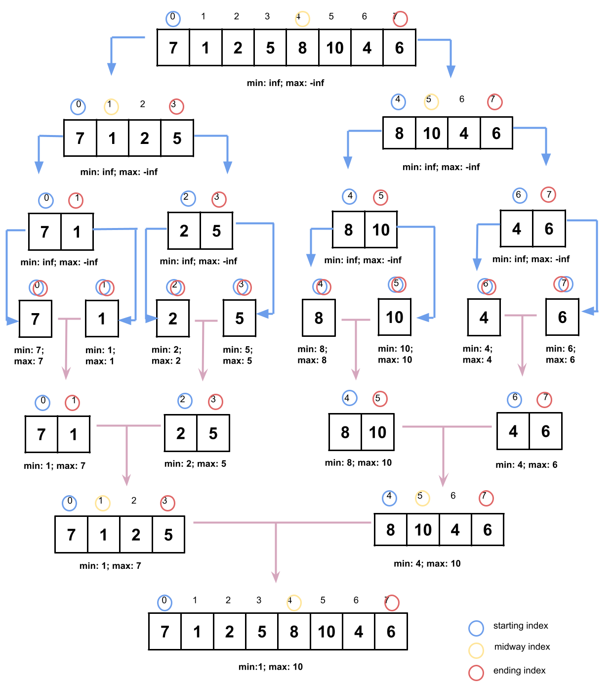

# Divide and Conquer

## Learning Goals

This lesson is intended to serve as an abbreviated walkthrough of the divide and conquer approach.

This lesson does not require prior knowledge about the divide and conquer technique, however you are encouraged to re-read the Divide and Conquer lesson under the Algorithmic Strategies topic provided during classroom* if you require more details about any of the review topics mentioned here.

If you did not have an opportunity to learn about these algorithms previously, you are invited to follow your curiosity and research any topics with which you are unfamiliar. Any topics that were not covered in classroom will be clearly indicated.

### !callout-info

## *Didn't review Divide and Conquer in Classroom?

No problem! Keep reading and you'll get a description of the most pertinent algorithms. However, further research may be required if deeper knowledge or example implementations are desired.

### !end-callout

## Overview

**Divide and Conquer** is an approach to problem solving that breaks down a large problem into multiple, smaller subproblems. We combine the results of those subproblems to solve the original problem.

When we write a divide-and-conquer solution we can follow these steps:

1. Break the problem into subproblems of the same type
1. Recursively solve the subproblems
1. Combine the solved subproblems to solve the larger problem

There can be several subproblems within a single problem, so we need to choose the correct subproblem involved. Most situations require us to divide the problem into two equal parts, but there are cases where a divide and conquer algorithm may require us to split the problem into three parts or more.

Solving the subproblems recursively requires us to carefully consider the input parameters for the recursive call of each subproblem. It is also crucial for us to have the correct base case for the recursion. To do so, we need to identify the smallest version of the subproblem for which we already know the solution.

Afterwards, we identify the correct operation for combining the solutions of the subproblems to get our final result.

## Algorithms Previously Covered

### Example: QuickSort

QuickSort is an algorithm which takes a divide-and-conquer approach to sorting an array by using the following steps:

1. If the array is only one element or empty, we are done, the array is sorted.
1. Pick an element from the array as the _pivot_.
1. Move all elements smaller than the pivot to the left and all elements larger than the pivot to the right. Note that the pivot is now in the correct index. Picking a pivot and rearranging the elements is referred to as _partitioning_.
1. Perform QuickSort on the left and right sides of the pivot.

![QuickSorting the array (7, 3, 9, 1, 6, 8, 2, 5) where the pivot is chosen by taking the last element in the array. The first pivot is 5, which after rearranging gives the array (3, 1, 2, 5, 6, 8, 9, 7). The left array (3, 1, 2) and right array (6, 8, 9, 7) are QuickSorted. 2 is selected as the pivot, and after rearranging, the left array becomes (1, 2, 3). The left and right arrays are (1) and (3), which are both 1 element, meaning they are sorted. Returning to (6, 8, 9, 7), 7 is picked as the pivot. After rearranging, the array becomes (6, 7, 9, 8). The left array is (6), which is sorted. The right array is (9, 8). 8 is selected as the pivot. After rearranging, the array becomes (8, 9). There is no left array, and the right is (9), which is sorted. All subarrays have been sorted, meaning the whole array is sorted, having become (1, 2, 3, 5, 6, 7, 8, 9).](images/algorithmic-strategies_divide-and-conquer_quick-sort.png)  
 _Fig. Tracing through an application of QuickSort in which the final element in a subarray is chosen as the pivot._

### Example: Merge Sort

Merge sort is another divide-and-conquer algorithm. It involves the following three stages:

1. _Divide_ the array into two subarrays at each step until each subarray is of size one.
2. _Sort_ each subarray with the merge sort algorithm. (An array of size one is trivially sorted.)
3. _Merge_ the subarrays into one array by combining two subarrays into one at each step.

![Merge sort example. The list starts with the values (7, 2, 8, 1, 6, 5, 3, 9) (s=0, m=4, e=8). This is split into to lists with one having (7, 2, 8, 1) (s=0, m=2, e=4), and the other having (6, 5, 3, 9) (s=4, m=6, e=8). Each list of four values is split into two lists of 2 value, resulting in 4 total lists. (7, 2) (s=0, m=1, e=2), (8, 1) (s=2, m=3, e=4), (6, 5) (s=4, m=5, e=6), and (3, 9) (s=6, m=7, e=8). Finally, each list of two is split into two single item lists for a total of 8 single item lists. (7) (s=0, e=1), (2) (s=1, e=2), (8) (s=2, e=3), (1) (s=3, e=4), (6) (s=4, e=5), (5) (s=5, e=6), (3) (s=6, e=7), (9) (s=7, e=8). Now each array has only a single value, making it implicitly sorted. The individual subarrays are merged so that they preserve their sorted property by combining them into a temporary array, then copying the sorted values over the merged range until the entire array becomes sorted.](images/algorithmic-strategies_divide-and-conquer_merge-sort.png)  
 _Fig. Example run of merge sort showing the index calculations used to split and merge the arrays. Note the convention used of the end index being exclusive._

### Example: Binary Search (Decrease-and-Conquer)

Binary search is often called a decrease-and-conquer algorithm because it decreases the size of the array by half with each step. No matter how large the original array was, at each step we'll be able to discard half the remaining data from consideration! The half-sized array will then be analyzed with the same step as the full-sized array.

Binary search is technically not a divide-and-conquer algorithm but instead a decrease-and-conquer algorithm because divide-and-conquer algorithms typically have *two or more* subproblems which are generated from the main problem. In contrast, the binary search algorithm decreases to one subproblem.

Here's a description of the binary search algorithm:

1. Starting with a sorted array, we check whether the array contains a particular value by comparing the search value with the element in the middle of the array.
1. If we find the value, return the position where it was found.
1. If we don't find the value, we determine whether it would be in the left or right half of the array by checking whether it is smaller or larger than the middle element. Remember, we can make this decision because _we assume the array is sorted!_ Then we perform a binary search on the selected half.
1. If at any point, we end up with an empty range, we know the value was not in the array, and we can return a result indicating the value was not found, such as `None`. Other variations of binary search may return the index of where the value _should_ have been, but as a negative value to indicate that the value was missing.
1. Each recursive call divides the array in half and performs the binary search on a smaller subproblem.

  
 _Fig. Looking for the position of the value 5 in a sorted array using binary search._

## Other Examples of Divide and Conquer Algorithms

The following material serves as an addendum to any Divide and Conquer content you may have covered in class. 

### Minimum and Maximum Elements in an Array

Suppose you are presented with the following problem:

*Given an integer array, find the minimum and maximum element present in it by making the minimum number of comparisons*

Let's solve this problem using the divide and conquer method.

The first step is to break the problem down into subproblems of the same type. We can do so by splitting the list into two halves repeatedly until there is only one element to observe. We will also need to keep track of the minimum and maximum elements we have encountered thus far. We will update the min and max once we've reached the base case of one element in the list.

1. Create placeholders for the minimum and maximum elements. Set the minimum to the maximum integer value, set the maximum to the minimum integer value.
1. Base Case: If there's only one element in the list, update the min and max by doing two comparisons
    1. If the min is bigger than the value of the one element in the list, update the min
    1. If the max is smaller than the value of the one element in the list, update the max
1. Recursively call the function on both halves of the list
1. Return the min and max values

In this algorithm we are dividing the list up until there is only one element, making comparisons of the minimum and maximum values to this one element and updating the values if needed, and then combining the results by storing the minimum and maximum values encountered during our recursive calls.

  
 _Fig. Performing a modified version of Merge Sort to identify the minimum and maximum values of an array._

### !callout-info

## Is there an echo in here?

You may notice similarities between this algorithm and the Merge Sort algorithm described above. If so, that's great! The Merge Sort and Binary Search algorithms are excellent models for a large number of divide-and-conquer algorithms. While it is not necessary to memorize these algorithms, we do recommend prioritizing thoroughly understanding how the Merge Sort and Binary Search algorithms work over any other divide-and-conquer algorithms. 

### !end-callout

<!-- >>>>>>>>>>>>>>>>>>>>>> BEGIN CHALLENGE >>>>>>>>>>>>>>>>>>>>>> -->

### !challenge

* type: code-snippet
* language: python3.6
* id: f08a392c-ccb2-463f-b085-ed3050c5adc4
* title: Minimum and Maximum Elements in an Array
* points: 0

##### !question

Given an integer array, find the minimum and maximum element present in it by making the minimum number of comparisons.

**Try implementing the algorithm below. Spend no more than 15 minutes on this**

##### !end-question

##### !placeholder
```py
def min_max(arr):
  '''
  INPUT: 1-dimensional array with integers which can be either positive or negative
  OUTPUT: Tuple where the first element is the minimum element in the array and the second element is the maximum element in the array.

  Example input:
  [7, 1, 8, 5, 10, 4, 2, 6]

  Example output:
  (1, 10)
  '''
  pass
```

##### !end-placeholder

##### !tests
```py
import unittest
import main as p

class TestPython1(unittest.TestCase):
    def test_one(self):
        # Arrange
        arr = [-2, -3, 4, -1, -2, 1, 5, -3]
        # Act
        minimum, maximum = p.min_max(arr)
        # Assert
        self.assertEqual(-3, minimum)
        self.assertEqual(5, maximum)

    def test_two(self):
        # Arrange
        arr = [-2,1,-3,4,-1,2,1,-5,4]
        # Act
        minimum, maximum = p.min_max(arr)
        # Assert
        self.assertEqual(-5, minimum)
        self.assertEqual(4, maximum)

    def test_three(self):
        # Arrange
        arr = [1]
        # Act
        minimum, maximum = p.min_max(arr)
        # Assert
        self.assertEqual(1, minimum)
        self.assertEqual(1, maximum)

    def test_four(self):
        # Arrange
        arr = [5,4,-1,7,8]
        # Act
        minimum, maximum = p.min_max(arr)
        # Assert
        self.assertEqual(8, maximum)
        self.assertEqual(-1, minimum)
```

##### !end-tests
### !end-challenge

<!-- ======================= END CHALLENGE ======================= -->

<details style="max-width: 700px; margin: auto;">

<summary>Click here to see a sample solution</summary>

```py
import sys
def min_max_helper(nums, left, right, minNum=sys.maxsize, maxNum=-sys.maxsize):
    # base case: the list is of size 1
    if left == right:
        # set minNum to the minimum of the remaining element and the current minimum stored in minNum
        minNum = min(nums[left], minNum)
        # set maxNum to the maximum of the remaining element and the current max stored in maxNum
        maxNum = max(nums[left], maxNum)
        return minNum, maxNum

    # find the middle element
    mid = (left + right) // 2

    # recur for the left sublist
    minNum, maxNum = min_max_helper(nums, left, mid, minNum, maxNum)

    # recur for the right sublist
    minNum, maxNum = min_max_helper(nums, mid + 1, right, minNum, maxNum)

    return minNum, maxNum

def min_max(nums):
    return min_max_helper(nums, 0, len(nums) - 1)
```
</details>

### Binary Search: A modified approach

Binary search can be used to solve many problems related to searching through sorted data. The following problem offers an opportunity to use the binary search algorithm using a modified approach.

```
Suppose we are given a sorted array of non-negative distinct integers. 
We would like to find the smallest missing non-negative element inside of the array.

If present, the array should start with the integer 0.
If the array contains all of the elements (none are missing), return the next number following the last number in the array.

For example:
If the array is [0, 1, 2, 6, 9, 11, 15], the smallest missing element is 3.

If the array is [0, 1, 2, 3, 4, 5], the smallest missing element is 6 as it is the first smallest element missing from the array.

If the array is [1, 2, 4, 5, 6], the smallest missing element is 0.
```

This problem can be solved in O(n) time using a linear search to find the first index containing an element whose value and index are not equal. However, this approach does not take advantage of the fact the input is sorted.

We can instead use a modified binary search algorithm to solve the problem in O(log(n)) time.

Spend *no more than 15 minutes* writing a modified binary search solution to the problem detailed above.

<!-- >>>>>>>>>>>>>>>>>>>>>> BEGIN CHALLENGE >>>>>>>>>>>>>>>>>>>>>> -->

### !challenge

* type: code-snippet
* language: python3.6
* id: b124a149-3361-4359-9582-ec8eec166f14
* title: Smallest Missing Element
* points: 0

##### !question

Suppose we are given a sorted array of non-negative distinct integers. 
We would like to find the smallest missing non-negative element inside of the array.

**Try implementing the algorithm below. Spend no more than 15 minutes on this**

##### !end-question

##### !placeholder
```py
def smallest_missing_num(nums):
  '''
  INPUT: 1-dimensional array with integers 
  OUTPUT: The integer which represents the smallest missing non-negative element inside of the array. If the array contains all of the elements, return the smallest number following the length of the array.

  Example input:
  [0, 1, 2, 6, 9, 11, 15]

  Example output:
  3
  '''
  pass
```

##### !end-placeholder

##### !tests
```py
import unittest
import main as p

class TestPython1(unittest.TestCase):
    def test_one(self):
        # Arrange
        arr = [0, 1, 2, 6, 9, 11, 15]
        # Act
        result = p.smallest_missing_num(arr)
        # Assert
        self.assertEqual(3, result)

    def test_two(self):
        # Arrange
        arr = [0, 1, 2, 3, 4, 5]
        # Act
        result = p.smallest_missing_num(arr)
        # Assert
        self.assertEqual(6, result)

    def test_three(self):
        # Arrange
        arr = [1, 2, 3, 4, 5]
        # Act
        result = p.smallest_missing_num(arr)
        # Assert
        self.assertEqual(0, result)
```

##### !end-tests
### !end-challenge

<!-- ======================= END CHALLENGE ======================= -->

<details style="max-width: 700px; margin: auto;">

<summary>Click here for pseudocode of the sample solution</summary>

Keep in mind that we are looking for the first index containing an element that does not match its value in the array.

1. For our function, we can pass in the array, and the range of indices we would like to check, `left` and `right`.
2. Our base case will check if the `left` index is greater than the `right` index. If so, the function will return the left index as this will be the first number that is missing from our list.
3. Now we'll work on the recursive step. The first step is to calculate the middle index and store it in `mid`.
    1. If we check the middle element and its value does match the index, the mismatch must be on the right side of the list, so we will recurse on the right side. 
    2. If we check the middle element and its value does not match the index, the mismatch must be on the left side of the list, so we will recurse on the left side of the list.

</details>


<details style="max-width: 700px; margin: auto;">

<summary>Click here to see a sample solution</summary>

```py
def smallest_missing_num_helper(nums, left, right):  
    # base case
    # if the left index is greater than the right index
    if left > right:
        # the left index is the first missing number
        return left

    # calculate the middle index
    mid = (left + right) // 2

    # if the mid index matches with its value, then the mismatch must lie on the right half
    if nums[mid] == mid:
        return smallest_missing_num_helper(nums, mid + 1, right)
    # otherwise, the mismatch must lie on the left half
    else:
        return smallest_missing_num_helper(nums, left, mid - 1)

def smallest_missing_num(nums):
    return smallest_missing_num_helper(nums, 0, len(nums) - 1)
```
</details>

## Check for Understanding

<!-- >>>>>>>>>>>>>>>>>>>>>> BEGIN CHALLENGE >>>>>>>>>>>>>>>>>>>>>> -->
<!-- Replace everything in square brackets [] and remove brackets  -->

### !challenge

* type: multiple-choice
* id: 645bad5d-af5f-42a9-a7e4-c70412972ab1
* title: Quicksort Weakness

##### !question

Which step in the Quicksort algorithm may cause the algorithm to run in O(N<sup>2</sup>) time?

##### !end-question

##### !options

a| If the array is only one element or empty, we are done, the array is sorted.
b| Pick an element from the array as the pivot.
c| Move all elements smaller than the pivot to the left and all elements larger than the pivot to the right.
d| Perform QuickSort on the left and right sides of the pivot.

##### !end-options

##### !answer

b|

##### !end-answer


##### !explanation

The worst-case time complexity for Quicksort is O(N<sup>2</sup>) because picking the worst pivot (e.g. the smallest or biggest remaining element) for each step will result in one array of size n-1 as opposed to two arrays that are approximately n/2 in length. Therefore, step 2: Pick an element from the array as the pivot, is the step, if incorrectly chosen, that may cause Quicksort to have an O(N<sup>2</sup>) runtime.

##### !end-explanation 

### !end-challenge

<!-- >>>>>>>>>>>>>>>>>>>>>> BEGIN CHALLENGE >>>>>>>>>>>>>>>>>>>>>> -->
<!-- Replace everything in square brackets [] and remove brackets  -->

### !challenge

* type: multiple-choice
* id: 25522151-56d9-4495-9691-da53700f896e
* title: Common Divide and Conquer Implementation Detail

##### !question

Which of the following lines in Python can be used to calculate the middle index used in step 1 of Binary Search and Merge Sort? Assume the variable `high` stores the upper bound of where we want to search in the array and `low` stores the lower bound for where we want to search in the array.

##### !end-question

##### !options

a| mid = (low - high) * 2
b| mid = (high - low) // 2
c| mid = (high + low) * 2
d| mid = (low + high) // 2

##### !end-options

##### !answer

d|

##### !end-answer

#### !explanation

The answer is (low + high) // 2 because the index calculated using that expression is the index of the middle element. For example, if the lower bound is 2 and the upper bound is 16, the middle element between indices 2 and 16 is the element in index 8. 

#### !end-explanation 

### !end-challenge

<!-- ======================= END CHALLENGE ======================= -->

## Summary

Divide and conquer is an algorithmic strategy which involves breaking down a large problem into easier-to-solve subproblems.

In a divide and conquer solution we break a large problem into one or more smaller subproblems and then use the solution to the subproblems to solve the larger problem.

## Resources

- [Wikipedia: Divide & Conquer](https://en.wikipedia.org/wiki/Divide-and-conquer_algorithm)
- [Daniel Liang's Binary Search Animation](https://yongdanielliang.github.io/animation/web/BinarySearchNew.html)
- [Geeks for Geeks: Python Program for QuickSort](https://www.geeksforgeeks.org/python-program-for-quicksort/)
- [hackerearth: QuickSort Animation](https://www.hackerearth.com/practice/algorithms/sorting/quick-sort/visualize/)
