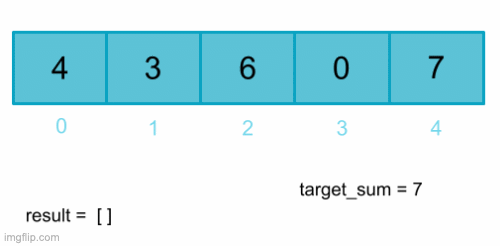

# Optional: Sliding Window Technique

## Overview

Within the broader category of dynamic programming, there are further techniques that can help us solve specific types of dynamic programming problems.

One useful strategy is called the **sliding window technique**. The sliding window technique is a strategy used to simplify time and space complexity when solving a problem that asks us to find some subsequence that satisifies a given set of conditions inside of a larger sequence.

## Understanding the Sliding Window Technique

Say we have some sequence of data that we want to examine. We can create a 'window' that allows us to look at some contiguous subsection of the data. Then we iterate through the remainder of the data by adjusting the start and end indices of the subsequence or window.  Each iteration either the start index, end index, or both indices move forward so that we have a  "sliding" subsequence that progresses through the original sequence until we have looked at every part of the original sequence.


This is called the sliding window technique because it mimics sliding a window open or shut. The section of data we are currently viewing shifts as we slide our window along the sequence.


We can make our window as small or large as we would like to solve a problem, but we must be interested in looking at contiguous - meaning adjacent and maintaining order - subsections of the sequence. If we are interested in combining non-adjacent sections of the larger sequence into a subsequence, we need to use a different strategy. To accommodate noncontiguous subsequences, we would need to split our window and in most cases it would be difficult to know when we had examined all the subsequences we were interested in.


### When to Apply the Sliding Window Technique
What types of data can the sliding window technique be applied to? When deciding.

#### Contiguous Stream of Data
When determining whether the sliding window technique is an appropriate approach for a given problem, the first thing we want to consider is what type of data we will be looking at. Our input should be a contiguous, linear, and iterable set of data stored such that we can create a window over it.

For example, we could perform the sliding window technique on an array, because we can create a `window` variable that holds some subset of the data using list slicing.

In the example below, the input array is `arr = [4, 3, 12, 4, -1]`

Our window is initally `window = [4, 3, 12]` or `window = [0:2]`. If we use variables to store where the array slice should start and stop, each time we want to slide our window, all we need to do is increment each of our start and stop variables by 1. 


We could do the same thing with a string using string slicing. In fact, most problems that can be solved with the sliding window technique will involve either a string or an array. 

It is also possible with some slight adjustments to perform the sliding window technique on a data structure such as a hashmap or a linked list, but accessing and storing values within the window may not be as straightforward because (at least in Python) we cannot slice a dictionary or linked list in the same way that we can a string or an array.

A data structure like a graph would be difficult to using the sliding window technique on, because it is not a linear data structure. How would we place and slide our window? 

#### Contiguous Subset
In order for the sliding window technique to be applicable, the problem must also ask us to find a contiguous subset of the problem.

For example, say you are given an array of integers and asked to find all adjacent pairs of integers in the list that add up to a given sum. This could be solved using the sliding window technique. Our window would be of size two and we can check each adjacent pair by starting the left end of the window at index 0 and shifting our window by one each iteration until the right end of the window is at the last index in the array.




However, if the problem were changed slightly and we were asked to instead find all  pairs of numbers in an array that add up to a given sum, adjacent or not, we could not use the sliding window technique. The elements we want to look at together wouldn't necessarily fit inside of a window.


#### Dynamic Programming Problem
Recall that the sliding window technique is used to solve a subset of dynamic programming problems. This means that problems solved with the sliding window technique should be optimization problems that maintain the optimal substructure property **and** have overlapping subproblems. 

The overlapping subproblems can be seen simply by observing the way we slide the window. Observe that when we shift the window in the array below, element 3 from the previous window is also in the new window. 


To determine whether the problem is composed of optimal substructures, consider whether the optimal overall solution is comprised of the optimal solution for its smallest subproblems for some sample inputs.

Some example questions we could solve with the sliding window technique include:
- [Given an array of integers, find the maximum sum subarray of a given size](https://www.geeksforgeeks.org/find-maximum-minimum-sum-subarray-size-k/)
- [Given an array of 0s and 1s, find the maximum sequence of continuous 1s that can be made by flipping at most k 0s to 1s](https://www.geeksforgeeks.org/find-zeroes-to-be-flipped-so-that-number-of-consecutive-1s-is-maximized/)
- [Given two strings, find the shortest substring in the first string that contains all the characters in the second string](https://leetcode.com/problems/minimum-window-substring/)

Some of these problems are very difficult! We expect that it will take time to work up to solving these problems independently and do not expect you to solve them as part of this lesson!

As always, there are some edge cases that may seem like sliding window problems but have other, more optimal solutions. However, in general, this is a good place to start. We will discuss at least one edge case in further detail later on in the lesson.

### Static Sliding Window

Now that we understand what the sliding window technique is, let's apply the technique to an example problem. 

#### Minimum Sum Subarray of Size K
Consider the following problem:

*Given an array of integers `numbers` and an integer `k`, return the sum of the minimum sum subarray of size `k`.*

In other words, given the array of integers `numbers`, calculate the minimum sum of `k` consecutive elements in the array.

Here are some example inputs

**Example 1**
Input:
`numbers = [-1, 5, 3, 1, -3, 2]`
`k = 2`
Output: `-2` 
- the minimum sum subarray would be [1, -3]

**Example 2**
Input: 
`numbers = [1, 2, 3, 4, 5]`
`k = 3`
Output: `6`
- the minimum sum subarray would be [1, 2, 3]

Input: 
`numbers = [1,2,3]`
`k = 4`
Output: `ValueError`
- the subarray must be shorter than the length of the original array

```py
def min_sum(numbers, k):

    #find the length of the given array
    nums_len = len(numbers)

    # if the subarray is longer than the original array, raise an error
    if nums_len < k:
        raise ValueError("k must be an integer between 1 and len(numbers)")

    # get the sum of the first window
    window_sum = sum(numbers[:k])
    
    # initialize the minimum overall sum to the sum of the first window
    min_sum = window_sum

    # our for loop will be the start index of each window
    # our last window will start at nums_len - k
    for i in range(nums_len - k):
        # to shift the window, subtract the value at the window's current starting index from its sum
        window_sum -= numbers[i] 
        # shift the window to the right by adding the value at the k + ith index to replace the value just removed
        window_sum += numbers[k + i]
        # set the overall minimum subarray sum to either the sum of the new window
        # or the minimum subarray sum calculated so far, whichever is smaller
        min_sum = min(min_sum, window_sum)
    
    # return the minimum sum
    return min_sum
```

We can visualize what the above code looks like below:


<!-- >>>>>>>>>>>>>>>>>>>>>> BEGIN CHALLENGE >>>>>>>>>>>>>>>>>>>>>> -->
<!-- Replace everything in square brackets [] and remove brackets  -->

### !challenge

* type: multiple-choice
* id: 00a787a2-56b8-48d6-b638-8aff766deedf
* title: Minimum Sum Subarray Time Complexity
<!-- * topics: [python, pandas] (Checkpoints only. optional the topics for analyzing points) -->

##### !question

What is the time complexity of the solution above? Imagine  *n* is the length of the array `numbers` and `k` is the given subarray size `k`

##### !end-question

##### !options

a| O(1)
b| O(n)
c| O(n^2)
d| O(k*n)
e| O(log n)

##### !end-options

##### !answer

b|

##### !end-answer

##### !explanation 
The time complexity is O(n) because if k is 1, we will loop through our for loop n times.
##### !end-explanation 

### !end-challenge

<!-- ======================= END CHALLENGE ======================= -->

Without the sliding window technique, how could we implement this problem? We could implement a solution with two nested loops, each maintaining a pointer for the start and end of our current subarray. Take a look at the solution in full detail below. 

```py
def min_sum(numbers, k):

    # initially overestimate what the minimum sum of any k consecutive elements in the array is 
    min_sum = float('inf')

    nums_len = len(numbers)

    # if the subarray is longer than the original array, raise an error
    if nums_len < k:
        raise ValueError("k must be an integer between 1 and len(numbers)")

    # the outer loop will be the start index of each subarray we look at
    # Our last possible subarray will start at with the nums_len - k element
    # since range is exclusive we add 1
    for i in range(nums_len - k + 1):
        # variable to hold the sum of the subarray we are looking at
        current_sum = 0
        # we want our subarray to go from numbers[i:(i+k)]
        # so our inner loop repeats k times so we can access the value at numbers[i]... numbers[i+k]
        for j in range(k):
            # add the value of each element in subarray to current_sum
            current_sum = current_sum + numbers[i + j]
        
        # set min_sum to whichever is smaller: 
            # sum of current subarray current_sum or the min_sum found so far
        min_sum = min(current_sum, min_sum)

    # return the result once we've checked all subarrays
    return min_sum
```

We can see that the time complexity of this solution would be O(k*n) where n is the length of the array `numbers` because of the nested loop. This is why the sliding window technique is so useful! **It allows us to reduce the complexity of problems that ordinarily would require a nested loop!**

### Dynamic Sliding Window

We can modify the sliding window technique by shifting the left and right edges of our window at different rates. This means that our window size can change throughout the program. 


This allows us to solve problems where we still want to find some contiguous subsequence, but we don't know what size that subarray will be beforehand. Let's take a look about how we can apply this to an example interview question.

#### Minimum Sublist
Say we are asked to solve the following problem:

*Write a function called `minimum_sub_list_length` that takes in a list of positive 
numbers `numbers` and a positive integer `target`.*  

*It should return the minimum length of a contiguous sublist of the given input 
list which adds up to the given integer.*


### Implementing Minimum Sublist

Notice that the above function asks us to to find a contiguous sublist, but that sublist could be of any size. This is an indication we need a dynamic sliding window. 

We can start by creating a window of size 1 from index 0 to index 1.  So our window's `start_index` is `0` and `end_index` is `1`. Our current sum then is the value of the 1st element of the list.

We track the following values:

* `start_index` - Where our window starts
* `end_index` - Where our window ends
* `current_sum` - The sum of the elements in the current window
* `min_length` - The length of the smallest contiguous sublist found thus far.

Then we can repeat this algorithm:

1.  If the current sum is equal to the target, we have found a contiguous sublist which adds up to target, and if it is the smallest contiguous sublist we have found so far, we update the minimum length.
      * We can also advance the window by incrementing the `start_index` by one.
2.  If the current sum is greater than or equal to the target we can decrease the window size by adding one to the start index of the window.
3.  If the current sum is less than the target we can increase the window size by adding one to the end index of the window.
4.  We will repeat this algorithm until the end index has passed the end of the list.

**Try implementing the algorithm below. Spend no more than 15 minutes on this**

### !challenge

* type: code-snippet
* language: python3.6
* id: 28bb873d-ec9b-4158-87ba-b466e382749e
* title: Smallest Contiguous Sublist Problem
* topics: python, lists, sliding-window

##### !question

Write a function called `minimum_sub_list_length` that takes in a list of positive numbers, `numbers` and a positive integer, `target`.

It should return the minimal length of a contiguous sublist of the given input list which adds up to the given integer. Use the sliding window technique in your implementation on this.

##### !end-question

##### !placeholder

```py
def minimum_sub_list_length(numbers, target):
    '''
    INPUT: list of positive numbers, and target a positive integer
    OUTPUT: the minimal length of a contiguous sublist of the given input list which adds up to the given integer.
    Using a dynamic sliding window, return the length of the smallest contiguous sublist which adds up to the given integer or 
    return None if there is no such sublist.
    '''

```

##### !end-placeholder

##### !tests

```py
import unittest
from main import *

class TestChallenge(unittest.TestCase):
    def test_with_empty_list_and_42(self):
        self.assertEqual(None,minimum_sub_list_length([], 42))

    def test_with_one_element_list_and_number_equal_to_the_element(self):
        self.assertEqual(1,minimum_sub_list_length([12], 12))

    def test_with_one_element_list_and_number__not_equal_to_the_element(self):
        self.assertEqual(None,minimum_sub_list_length([12], 42))

    def test_with_1_2_3_4_and_target_7(self):
        self.assertEqual(2,minimum_sub_list_length([1, 2, 3, 4], 7))

    def test_with_4_3_2_1_and_target_7(self):
        self.assertEqual(2,minimum_sub_list_length([4, 3, 2, 1], 7))

    def test_with_1_2_3_4_and_target_10(self):
        self.assertEqual(4,minimum_sub_list_length([1, 2, 3, 4], 10))

    def test_with_1_3_4_and_target_5(self):
        self.assertEqual(2,minimum_sub_list_length([1, 3, 4], 7))

    def test_with_1_2_3_4_5_and_target_5(self):
        self.assertEqual(1,minimum_sub_list_length([1, 2, 3, 4, 5], 5))
```

##### !end-tests

<!-- other optional sections -->
#### !hint 
Feeling stuck? Take a look at the video solution below! 
<br>
<iframe src="https://adaacademy.hosted.panopto.com/Panopto/Pages/Embed.aspx?id=3815b463-50b3-45df-9e06-af380186ca4f&autoplay=false&offerviewer=true&showtitle=true&showbrand=false&captions=true&interactivity=all" height="360" width="640" style="border: 1px solid #464646;" allowfullscreen allow="autoplay"></iframe>

#### !end-hint
##### !explanation

A sample solution could be:

  ```py
  def minimum_sub_list_length(numbers, target):
    '''
    INPUT: list of positive numbers, and target a positive integer
    OUTPUT: the minimal length of a contiguous sublist of the given input list which adds up to the given integer.
    Return the length of the smallest contiguous sublist which adds up to the given integer or 
    return None if there is no such sublist.
    '''
    if len(numbers) == 0:
        return None
          
    start_index = 0
    end_index = 1
    current_sum = numbers[0]
    min_length_sublist = len(numbers) + 1
  
    while end_index < len(numbers) + 1:

        if current_sum == target:
            min_length_sublist = min(min_length_sublist, end_index - start_index)

            current_sum -= numbers[start_index]
            start_index += 1

        elif current_sum < target:
            if end_index < len(numbers):
                current_sum += numbers[end_index]
            end_index += 1
            
        elif current_sum > target:
            current_sum -= numbers[start_index]
            start_index += 1

    if min_length_sublist == len(numbers) + 1:
        return None
    return min_length_sublist
  ```
##### !end-explanation

### !end-challenge

This solution now makes only one pass through the list, meaning as the input array grows, the solution will be O(n) which is much better than the brute force solution. 

If interested, take a look at how the sliding window solution above compares to the brute force technique.

<details style="max-width: 700px; margin: auto;">
  <summary>Click here to see a sample solution</summary>
    ```py
    def minimum_sub_list_length(numbers, target):
        '''
        INPUT: list of positive numbers, and target a positive integer
        OUTPUT: the minimal length of a contiguous sublist of the given input list which adds up to the given integer.
        Return the length of the smallest contiguous sublist which adds up to the given integer or 
        return None if there is no such sublist.
        '''
        # if the target sum is 0, we can reach the sum simply by not adding any elements to the sublist
        if target == 0:
            # so we return that the length of the minimum sublist is 0 (an empty list)
            return 0
        
        # initialize the minimum length to be the length of the initial length plus one
        min_length = len(numbers) + 1
    
        for index in range(0, len(numbers)):
            current_sum = numbers[index]
            current_index = index + 1
            while current_index < len(numbers) and \
                    current_sum + numbers[current_index] <= target:
                current_sum += numbers[current_index]
                current_index += 1
            
            if current_sum == target and current_index - index < min_length:
                min_length = current_index - index
        
        if min_length == len(numbers) + 1:
            return None
        
        return min_length
    ```
</details>

<!-- available callout types: info, success, warning, danger, secondary, star  -->
### !callout-info

## Why Do We Need Kadane's Algorithm?
You may recall that in the dynamic programming lesson, we asked you to solve a very similar problem to the one above: maximum . The key difference was that in that array non-positive numbers were allowed.

<break>

Try using the algorithm we developed for the problem above on this input array: `[-1, -4, 0, 5, 3, 2, 1]`. Assume the `target` is 5. The sliding window assumes that the sum of the window increases with each shift to the right, but because of the presence of negative numbers in some cases the sum decreases. The right edge of our window will end up past the element at index 3, `5` before we ever start shifting the left edge of our window. Thus we will never catch index 3 as its own valid subarray adding up to the target value.

<break>

It is possible to modify the sliding window technique to work with non-positives, but Kadane's algorithm is easier and more efficient!
### !end-callout

## Summary

The sliding window technique is a useful technique that helps us solve optimization problems that ask us to find a contiguous subsequence within a larger sequence. Note that the dynamic sliding window technique often doesn't work on problems where sums and negative numbers are involved.

Our sliding window can be static meaning that it stays a fixed size as it progresses through the sequence or dynamic meaning that the right and left edges of our window can progress at different rates.