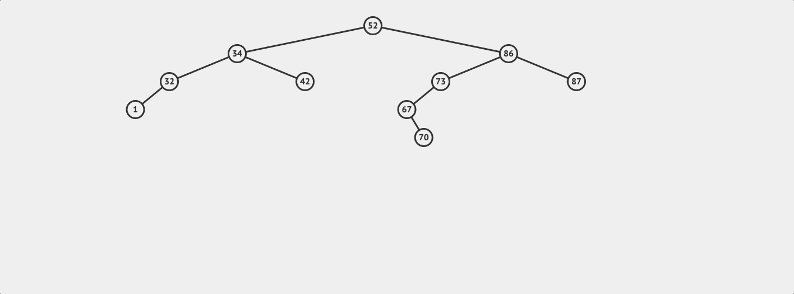
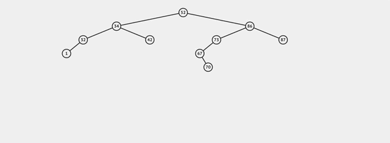

# Binary Search Trees

<iframe src="https://adaacademy.hosted.panopto.com/Panopto/Pages/Embed.aspx?id=d9746397-8a10-43be-b1cc-aaaf00720b31&autoplay=false&offerviewer=true&showtitle=true&showbrand=false&start=0&interactivity=all" height="405" width="720" style="border: 1px solid #464646;" allowfullscreen allow="autoplay"></iframe>

## Learning Goals

Students should be able to:

- Compare a Binary Tree to a Linked List
- Explain how a Binary Search Tree differs from a generic Binary Tree
- Write methods to perform the following on a Binary Search tree:
  - Search
  - Insert value
  - Delete value
  - Find height
  - Perform traversals including: 
    - Depth first traversals: pre-order, in-order, post-order
    - Breadth first traversal

## Video Lesson & Exercises

- [Video Lesson](https://adaacademy.hosted.panopto.com/Panopto/Pages/Viewer.aspx?id=d9746397-8a10-43be-b1cc-aaaf00720b31)
- [Slide Deck](https://docs.google.com/presentation/d/1Fj0deIUswGZ3ooJMpgVUqPEaWHKTkQ1w2Ci-yf8v66M/edit#slide=id.p)
- [BST Exercise](https://github.com/Ada-C13/tree-practice)

## Vocabulary

## Vocabulary and Synonyms

| Vocab          | Definition                                                    | Synonyms  | How to Use in a Sentence                                                      |
| -------------- | ------------------------------------------------------------- | --------- | ----------------------------------------------------------------------------- |
| Linked List | a linear collection of data elements whose order is not given by their physical placement in memory.  Each element of the list contains a reference to the next element.     |       | "Because I wanted to add and remove elements to the front and rear, I used a linked list to store the data." |
| Tree      | A widely used abstract data type that simulates a hierarchical tree structure, with a root value and subtrees of children with a parent node, represented as a set of linked nodes. |  | "I used a tree to store ordered data." |
| Binary Tree      | A tree structure in which each node has at most two children, which are referred to as the _left child_ and _right child_. |  | "A Mathematical expression can be written as a binary tree where the leaves are values and the parent nodes are operators like +, -, *, and /." |
| Binary Search Tree      | A specific type of Binary Tree which is a rooted binary tree data structure whose internal nodes each store a key greater than all the keys in the node’s left subtree and less than those in its right subtree. | Ordered Binary Tree | "Because 23 is less than the root, it can only be found in the left subtree of this binary search tree." |
| Leaf      | A node in a tree with no descendants. |  | "Because the left and right subtrees of the current node were `None`, this node is a leaf." |
| Parent      | A node with descendants. |  | "Because the left and right subtrees of the current node not `None`, this node is a parent and not a leaf." |
| Unbalanced Tree 	|  A BST where each node has 0 or 1 children (it looks like a linked list) 	| | The tree was unbalanced so inserting new values too linear time. |
| Balanced Tree 	| A tree where the the level of any two leaves differs by at most 1 node.	| | "Because my tree is balanced, it's quick to find values inside it."  |
| Subtree | The tree which is a child of a node. Note: The name emphasizes that everything which is a descendant of a tree node is a tree, too, and is a subset of the larger tree.| | "The value I'm looking for is less than the current node, so I will continue searching in the left subtree." |
| Traversal 	|  A method of visiting each node in a BST	| | "My method performs a traversal visiting each node in the tree, level-by-level." |
| Depth-First Traversal 	|  An algorithm for traversing or searching a tree. The algorithm starts at the root node and explores as far as possible along each branch before backtracking.	| | A depth-first traversal looks like a mouse exploring a maze in that it goes as far down one path before backtracking when encountering dead ends. |
| Breadth-first traversal 	|  An algorithm for searching a tree data structure for a node that satisfies a given property. It starts at the tree root and explores all nodes at the present depth prior to moving on to the nodes at the next depth level. 	| | I printed out the tree level-by-level so I had to perform a breadth-first traversal. |

## Sample Problem

Ada is working on software powering an online store.  Their application needs to maintian a list of products in memory and maintain them in order by price.  The app should be able to list all the products sorted by price, and look up individual items at a particular price.  The application will also need to add products as they are added to inventory and remove them when they are sold out.

They could maintain a sorted array.  It's very quick to find individual elements by executing a binary search O(log n), and because the list is in order, simply traversing the array will display the items sorted by price.

However removing an element requires all the elements to the right of the deleted item to be shifted left one position.  This means that deleting an element requires a time complexity of O(n).


<!-- Image at:  https://drive.google.com/file/d/1PeYa3z7mgVxy6jOPqS7brL09u2Vq_nFW/view?usp=sharing -->

Adding an element to a sorted list similarly requires each item to be shifted before a new item can be inserted.  


<!-- Image source:  https://www.draw.io/#G1j_vbvEN5UgNSszrKSPgwA7agvgQdhs1r -->

### What About a Linked List

Likewise we could use a Linked List, but we cannot do a binary search on a Linked List.  Any search in a Linked List requires a time complexity of O(n).

Further maintaining a list in order requires Ada's application to **find** the location in the list to do the insertion.  So while adjusting the links to insert a new node in a Linked List is O(1), finding the place to do the insertion would be O(n).  **Doh!**

So while we want to:

1. Maintain a list of items in order.
1. Add and delete elements in better than O(n) time
1. Find elements with an O(log n) time

If need 1 is maintained an array will struggle to add and delete items, and a Linked List will require O(n) for all operations because you have to traverse the sorted list to do anything. 

So is Ada stuck with O(n) operations?  No!  Enter Binary Search Trees!

## Enter Binary Trees

Our Linked Lists are a linear structure with each node linking to the next node in the structure.


Our Node class from the LinkedList topic, which will be referred to as `ListNode`, looked like this:

```python
class ListNode:
    def __init__(self, value, next=None):
        self.data = value
        self.next = next
```

The `ListNode` class was used in a larger `LinkedList` class which maintained a chain of `ListNode` objects starting with a node pointed to by an instance variable called `head`.

### Consider A Nonlinear Structure...

In a _Binary Search Tree_ each node's left pointer points to all elements smaller than or equal to the node's key.  The right pointer points to all nodes greater than the given node's key.   Each node can refer to other nodes.  A Tree is hierarchical with certain nodes acting as parents to others.  A node above another is the node's _parent_.  The node(s) below a node are it's _children_.  The topmost node in a tree is known as the _root_.  The nodes with no children are called _leaves_.

In a Binary Search Tree:
- Nodes with values less than any node are stored to the **left** of that node.
- Nodes with values greater than any node are stored to the **right** of that node. 


### Binary Search Tree Node

Instead of a node with one link to a next node, we can create nodes with 2 pointers, left and right.  Since each node can have 2 successors or "children", it forms a binary structure as opposed to the linear structure of a Linked List.

This node stores both a key and value for each node.  The `Tree` class will compare keys to maintain node order.

```python
class TreeNode:
    def __init__(self, key, val = None):
        if val == None:
            val = key

        self.key = key
        self.value = val
        self.left = None
        self.right = None```
```

### The Tree Class

Just like the `LinkedList` class discussed above, we can create a `Tree` class to represent the full data structure, using the `TreeNode` class to create nodes and build the tree.

```python
class Tree:
    def __init__(self):
        self.root = None # The root is the starting
                  # node in the Tree
    # Tree methods go here...
```

**Exercise**

Given the following values draw a binary search tree:

"Ringo", "John", "Paul", "George" sorted alphabetically.

The _root_ is where the tree begins, the topmost node.  New nodes as they are added are placed to the left or a given node, if they are less than or equal to the current node, and to the right if they are greater than the current node.  This is a natually recursive process.

```
Method add:
  if the root is nil set the root to be a new node with the given value and return the node.

  Otherwise:
    if the value is less than or equal to the current node's value, make the current node's left be the result of calling add on root's left.
    otherwise make node's right be the result of calling add on node's right.
```



You can experiment with this in the [Binary Tree Visualizer](https://visualgo.net/en/bst)

## Finding a Value

You can try to search to find a value in a Binary Search Tree Like this:

```
Start the current node at the root
If the current node is nil return nil
If the current node equals the value being searched for return the current node's data

If the value is less than the current node return search on current node's left side
If the value is greater than the root return search on current node's right side
```

**Exercise** 

Try this out on the [Binary Tree Visualizer](https://visualgo.net/en/bst).

**Question**:  If you have a tree of height 5, what's the worst-case for finding a value in the tree?  What affects the number of comparisons you need to make?

<details style="max-width: 700px; margin: auto;">
  <summary>
    Open this to see our answer.
  </summary>

  Worst-case, you need to make comparisons to 5 nodes before inserting.  This occurs when you need to insert a new node into a leaf.

  Worst-case:  O(h) comparisons where _h_ is the height of the tree
</details>

## Finding A Node With Python



You can implement the `find` method in Python as follows:

```python
class Tree:
    def __init__(self):
        self.root = None
    
    def find(self, key):
        current = self.root

        while current != None:
            if current.key == key:
                return current.value
            elif key < current.key:
                current = current.left
            else:
                current = current.right

        return None
```

### Recursive Find Method

Because every node in a Binary Search Tree is the root of a subtree, you can take advantage of the recursive structure to write a recursive solution.

```python
class Tree:
    def __init__(self):
        self.root = None
    
    def find_helper(self, current, value):
        if current == None:
            return False
        elif current.data == value:
            return True
        elif value < current.data:
            return self.find_helper(current.left, value)

        return self.find_helper(current.right, value)

    def find(self, value):
        return self.find_helper(self.root, value)
```

## Balanced Trees & Unbalanced Trees

A tree is considered **balanced** if the levels of any two leaves differ by at most 1.  In this way the nodes in the tree must be spread fairly evenly.

This is an example of a balanced tree.


On the other hand this is an unbalanced tree.


<!-- >>>>>>>>>>>>>>>>>>>>>> BEGIN CHALLENGE >>>>>>>>>>>>>>>>>>>>>> -->
<!-- Replace everything in square brackets [] and remove brackets  -->

### !challenge

* type: number
* id: 476cab10-a81f-4877-aad3-682602a3c30d
* title: How many nodes do you need to examine to find 5, in the 1st example?
* decimal: 0
* points: 1
* topics: bst

##### !question

How many nodes do you need to examine to find 5, in the 1st example?

##### !end-question

##### !placeholder

put a number in here

##### !end-placeholder

##### !answer

3

##### !end-answer

<!-- other optional sections -->
<!-- !hint - !end-hint (markdown, users can see after a failed attempt) -->
<!-- !rubric - !end-rubric (markdown, instructors can see while scoring a checkpoint) -->
<!-- !explanation - !end-explanation (markdown, students can see after answering correctly) -->

### !end-challenge

<!-- ======================= END CHALLENGE ======================= -->

<!-- >>>>>>>>>>>>>>>>>>>>>> BEGIN CHALLENGE >>>>>>>>>>>>>>>>>>>>>> -->
<!-- Replace everything in square brackets [] and remove brackets  -->

### !challenge

* type: number
* id: 5a4ce281-7f17-47e5-961e-a582171eb3be
* title: How many nodes to check in the 2nd example?
* decimal: 0
* points: 1
* topics: bst

##### !question

How many in the 2nd?

##### !end-question

##### !placeholder

Number goes here

##### !end-placeholder

##### !answer

5

##### !end-answer

<!-- other optional sections -->
<!-- !hint - !end-hint (markdown, users can see after a failed attempt) -->
<!-- !rubric - !end-rubric (markdown, instructors can see while scoring a checkpoint) -->
<!-- !explanation - !end-explanation (markdown, students can see after answering correctly) -->

### !end-challenge

<!-- ======================= END CHALLENGE ======================= -->


<!-- >>>>>>>>>>>>>>>>>>>>>> BEGIN CHALLENGE >>>>>>>>>>>>>>>>>>>>>> -->
<!-- Replace everything in square brackets [] and remove brackets  -->

### !challenge

* type: number
* id: b7d69d24-04e0-4891-beaa-ccbb81f73fed
* title: 5 level tree
* decimal: 0
* points: 1
* topics: bst

##### !question

With the [Binary Tree Visualizer](https://visualgo.net/en/bst), build a balanced tree with a height of 5 levels.  How many comparisons do you need to make to find a particular leaf node?

##### !end-question

##### !placeholder

Number goes here

##### !end-placeholder

##### !answer

5

##### !end-answer

<!-- other optional sections -->
<!-- !hint - !end-hint (markdown, users can see after a failed attempt) -->
<!-- !rubric - !end-rubric (markdown, instructors can see while scoring a checkpoint) -->
<!-- !explanation - !end-explanation (markdown, students can see after answering correctly) -->

### !end-challenge

<!-- ======================= END CHALLENGE ======================= -->

<!-- >>>>>>>>>>>>>>>>>>>>>> BEGIN CHALLENGE >>>>>>>>>>>>>>>>>>>>>> -->
<!-- Replace everything in square brackets [] and remove brackets  -->

### !challenge

* type: number
* id: 0dd499dc-7260-4d51-aabd-b9f4560e1047
* title: 6 level tree
* decimal: 0
* points: 1
* topics: bst

##### !question

Add 5 more nodes to the balanced tree, maintaining the balance.  How many comparisons do you need to make now to find a particular leaf node?

##### !end-question

##### !placeholder

Number goes here

##### !end-placeholder

##### !answer

6

##### !end-answer

<!-- other optional sections -->
##### !hint 

How many levels does adding 5 nodes add, if you maintain balance?

##### !end-hint
<!-- !rubric - !end-rubric (markdown, instructors can see while scoring a checkpoint) -->
<!-- !explanation - !end-explanation (markdown, students can see after answering correctly) -->

### !end-challenge

<!-- ======================= END CHALLENGE ======================= -->

<!-- >>>>>>>>>>>>>>>>>>>>>> BEGIN CHALLENGE >>>>>>>>>>>>>>>>>>>>>> -->
<!-- Replace everything in square brackets [] and remove brackets  -->

### !challenge

* type: number
* id: f32167e5-2264-49bc-8850-f81afd0f697b
* title: Unbalanced 5 level tree
* decimal: 0
* points: 1
* topics: bst

##### !question

Build a completely unbalanced tree with 5 levels.  How many comparisons to find a leaf node?

##### !end-question

##### !placeholder

Number here

##### !end-placeholder

##### !answer

5

##### !end-answer

<!-- other optional sections -->
##### !hint

What's the worst case?

##### !end-hint
<!-- !rubric - !end-rubric (markdown, instructors can see while scoring a checkpoint) -->
##### !explanation

Worst-case you have to travel to the last node in the chain and since there are 5 levels, it takes 5 comparisons

##### !end-explanation

### !end-challenge

<!-- ======================= END CHALLENGE ======================= -->

<!-- >>>>>>>>>>>>>>>>>>>>>> BEGIN CHALLENGE >>>>>>>>>>>>>>>>>>>>>> -->
<!-- Replace everything in square brackets [] and remove brackets  -->

### !challenge

* type: number
* id: a97fce91-ee27-4f04-be01-7484247a236e
* title: Adding 4 more unbalanced nodes
* decimal: 0
* points: 1
* topics: bst

##### !question

What if you added 4 nodes and kept the tree unbalanced. How many more comparisons would you need to make?

##### !end-question

##### !placeholder

Number goes here 

##### !end-placeholder

##### !answer

9

##### !end-answer

<!-- other optional sections -->
##### !hint

If you have 5 levels and add 4 more nodes, how many levels do you gain if the tree is totally unbalanced?

##### !end-hint
<!-- !rubric - !end-rubric (markdown, instructors can see while scoring a checkpoint) -->
##### !explanation

Worst case you added 4 more levels 5 + 4 = 9, so 9 comparisons to find the value.

##### !end-explanation

### !end-challenge

<!-- ======================= END CHALLENGE ======================= -->

<!-- >>>>>>>>>>>>>>>>>>>>>> BEGIN CHALLENGE >>>>>>>>>>>>>>>>>>>>>> -->
<!-- Replace everything in square brackets [] and remove brackets  -->

### !challenge

* type: short-answer
* id: 78ea3ad2-2a41-496b-af4a-535720e0e4f4
* title: Growth as `n` changes
* points: 1
* topics: bst

##### !question

Create a tree with one node.  Then double the number of nodes, **keeping the tree balanced.**  Then double the number of nodes again, maintaining balance.  Notice how the height changes.

What standard Big-O time complexity does this match?
  

##### !end-question

##### !placeholder

O(?)

##### !end-placeholder

##### !answer

/O\(log n\)/

##### !end-answer

<!-- other optional sections -->
##### !hint 

Answer in the form of O(n), O(nlog n) or O(log n) etc

##### !end-hint
<!-- !rubric - !end-rubric (markdown, instructors can see while scoring a checkpoint) -->
##### !explanation 

O(log n) when you double the number of nodes, the height increases by 1.

##### !end-explanation

### !end-challenge

<!-- ======================= END CHALLENGE ======================= -->

Notice if a tree is balanced, when you move left or right, you eliminate half of the possible nodes.  This means you are essentially doing **binary search.**  If the tree is unbalanced, you are performing a linear search.

**Self-Balancing Trees** There are a lot of algorithms for [keeping a tree balanced](https://en.wikipedia.org/wiki/Self-balancing_binary_search_tree).  The act of keeping a tree balanced is also O(log n), and so rebalancing a tree after an insertion or deletion doesn't significantly impact the runtime of a binary search tree.  These structures are wonderful things to learn, but beyond the scope of this class.  You **can** however rest assured that any library tree classes that you use will keep the tree balanced in such a manner.

## Traversals

A _traversal_ is an action visiting each node in a graph such as a tree.  There are several kinds of traversals, Breadth First Traversals which visit each node level, by level and Depth First Traversals which visit a node's children before it's siblings.

### Depth First Traversals

Unlike linear data structures like arrays or linked list which have only one logical way to traverse them, trees can be traversed in different ways.  In a _Depth-first traversal_ you explore the children and grandchildren of a node before moving to it's sibling.

There are three standard types of depth-first traversals:

- **Pre-Order**:  Current, Left, Right
- **In-Order**: Left, Current, Right
- **Post-Order**: Left, Right, Current

In a **Pre-Order** traversal you execute the algorithm in this manner:

```
visit the current node
traverse the left subtree
traverse the right subtree
```

In a **In-Order** traversal you execute the algorithm in this manner:

```
traverse the left subtree
visit the current node
traverse the right subtree
```

In a **Post-Order** traversal you execute the algorithm in this manner:

```
traverse the left subtree
traverse the right subtree
visit the current node
```

Notice that all of the algorithms are recursive in structure because each node can be treated as it's own subtree.


For the above Binary Search Tree
- **Pre-Order**:  [50, 25, 10, 30, 75, 60, 100]
- **In-Order**: [10, 25, 30, 50, 60, 75, 100]
- **Post-Order**: [10, 30, 25, 60, 100, 75, 50]

<!-- >>>>>>>>>>>>>>>>>>>>>> BEGIN CHALLENGE >>>>>>>>>>>>>>>>>>>>>> -->
<!-- Replace everything in square brackets [] and remove brackets  -->

### !challenge

* type: number
* id: 83e29c11-66b7-4b74-a85b-4fe936c92fa2
* title: Height of a tree
* decimal: 0
* points: 1
* topics: bst

##### !question


What is the height of the above BST?

##### !end-question

##### !placeholder

Number goes here

##### !end-placeholder

##### !answer

3
##### !end-answer

<!-- other optional sections -->
<!-- !hint - !end-hint (markdown, users can see after a failed attempt) -->
<!-- !rubric - !end-rubric (markdown, instructors can see while scoring a checkpoint) -->
<!-- !explanation - !end-explanation (markdown, students can see after answering correctly) -->

### !end-challenge

<!-- ======================= END CHALLENGE ======================= -->

<!-- >>>>>>>>>>>>>>>>>>>>>> BEGIN CHALLENGE >>>>>>>>>>>>>>>>>>>>>> -->
<!-- Replace everything in square brackets [] and remove brackets  -->

### !challenge

* type: multiple-choice
* id: a1703f9c-c97c-4b7a-86cf-cadb8780c77f
* title: Balanced
* points: 1
* topics: bst

##### !question


Is the tree balanced?

##### !end-question

##### !options

* Yes
* No
* Huh?

##### !end-options

##### !answer

* Yes

##### !end-answer

<!-- other optional sections -->
##### !hint

In a balanced tree no sibling subtrees differ in height more than 1.  So no left-right subtrees differ in height by 1.

##### !end-hint
<!-- !rubric - !end-rubric (markdown, instructors can see while scoring a checkpoint) -->
<!-- !explanation - !end-explanation (markdown, students can see after answering correctly) -->

### !end-challenge

<!-- ======================= END CHALLENGE ======================= -->


<!-- >>>>>>>>>>>>>>>>>>>>>> BEGIN CHALLENGE >>>>>>>>>>>>>>>>>>>>>> -->
<!-- Replace everything in square brackets [] and remove brackets  -->

### !challenge

* type: multiple-choice
* id: e755df96-56ec-4d50-a336-3834838abb96
* title: Inorder
* points: 1
* topics: bst, traversal

##### !question


In what order would you hit the nodes doing an inorder traversal

##### !end-question

##### !options

* [17, 14, 20, 19, 52]
* [14, 17, 19, 20, 52]
* [14, 19, 52, 20, 17]

##### !end-options

##### !answer

* [14, 17, 19, 20, 52]

##### !end-answer

<!-- other optional sections -->
<!-- !hint - !end-hint (markdown, users can see after a failed attempt) -->
<!-- !rubric - !end-rubric (markdown, instructors can see while scoring a checkpoint) -->
<!-- !explanation - !end-explanation (markdown, students can see after answering correctly) -->

### !end-challenge

<!-- ======================= END CHALLENGE ======================= -->


<!-- >>>>>>>>>>>>>>>>>>>>>> BEGIN CHALLENGE >>>>>>>>>>>>>>>>>>>>>> -->
<!-- Replace everything in square brackets [] and remove brackets  -->

### !challenge

* type: multiple-choice
* id: 08e94a48-fc15-4d95-8a47-d8ed9e199b34
* title: Preorder
* points: 1
* topics: bst, traversal

##### !question


In what order would you hit the nodes doing an preorder traversal

##### !end-question

##### !options

* [17, 14, 20, 19, 52]
* [14, 17, 19, 20, 52]
* [14, 19, 52, 20, 17]

##### !end-options

##### !answer

* [17, 14, 20, 19, 52]

##### !end-answer

<!-- other optional sections -->
<!-- !hint - !end-hint (markdown, users can see after a failed attempt) -->
<!-- !rubric - !end-rubric (markdown, instructors can see while scoring a checkpoint) -->
<!-- !explanation - !end-explanation (markdown, students can see after answering correctly) -->

### !end-challenge

<!-- ======================= END CHALLENGE ======================= -->


<!-- >>>>>>>>>>>>>>>>>>>>>> BEGIN CHALLENGE >>>>>>>>>>>>>>>>>>>>>> -->
<!-- Replace everything in square brackets [] and remove brackets  -->

### !challenge

* type: multiple-choice
* id: c6009e6c-5717-459a-ae66-4570918271b9
* title: Postorder
* points: 1
* topics: bst, traversal

##### !question


In what order would you hit the nodes doing an postorder traversal

##### !end-question

##### !options

* [17, 14, 20, 19, 52]
* [14, 17, 19, 20, 52]
* [14, 19, 52, 20, 17]

##### !end-options

##### !answer

* [14, 19, 52, 20, 17]

##### !end-answer

<!-- other optional sections -->
<!-- !hint - !end-hint (markdown, users can see after a failed attempt) -->
<!-- !rubric - !end-rubric (markdown, instructors can see while scoring a checkpoint) -->
<!-- !explanation - !end-explanation (markdown, students can see after answering correctly) -->

### !end-challenge

<!-- ======================= END CHALLENGE ======================= -->

### Why Do Traversals

There are a few common use-cases for each of the depth-first traversals.

- **Pre-order** If you need to save a tree data structure to disk, or send it across the network and maintain the structure, pre-order traversals can be useful.
- **In-Order**: If you need to print or otherwise visit all the nodes of a tree in order.
- **Post-Order**: If you need to delete all the nodes in a BST.

### !callout-info

## Why are they all left-to-right?

So why are all the traversals left-to-right instead of right-to-left?

Computer Science was initially pioneered in western cultures where people read left-to-right and so their cultural bias lead to designing traversals in that manner.  There's nothing inherit in Binary Search Trees to require this.  You could create a right-to-left traversal, but for historical reasons, these are the standard Binary Search Tree traversals.

### !end-callout

### Binary Expression Trees

There is also a kind of tree called a [Binary Expression Tree](https://www.geeksforgeeks.org/expression-tree/), which is a type of tree used to represent an arithetic formula.  In order traversals allow you to present the formula in the traditional manner while the preorder (prefix) and postorder (postifx) traversals can make the order more clear to machines.


## Finding the Height of a Binary Search Tree

To find the height of a binary search tree you can do the following:

```
If the current node is nil return 0

Otherwise return 1 plus the maximum of the heights of the right and left subtrees
```

This is a recursive solution because it treats the left and right sides of a node as trees.


## Summary

In this lesson we looked at the advantages a Binary Search Tree provides over a sorted array or LinkedList.  Binary Search trees provide an O(log n) time to add, remove and find elements because searching a tree performs a binary search.  This performance however depends on the tree being **balanced**.  A balanced tree has subtrees of height within 1 of each other.

We also examined different methods to traverse a Tree.  Unlike a LinkedList where there is only one method to traverse a tree has multiple ways to traverse.

## Big-O Comparison

As you can see below a balanced Binary Search Tree provides good performance while maintaining elements in order.  

**#**|**Data Structure**|**Access By Key**|**Search**|**Insertion (Middle)**|**Deletion (Middle)**|**Add First**|**Add Last**
:-----:|:-----:|:-----:|:-----:|:-----:|:-----:|:-----:|:-----:
1|Unsorted Array|O(1)|O(n)|O(n)|O(n)|O(n)|O(1)
2|Sorted Array|O(1)|O(log n)|O(n)|O(n)|O(n)|O(1)
3|Linked List|O(n)|O(n)|O(n)|O(n)|O(1)|O(1)
4|Binary Tree (balanced)|O(log n)|O(log n)|O(log n)|O(log n)|NA|NA
5|Hash Table|O(1)|O(1)|O(1)|O(1)|NA|NA

## Additional Resources

- Recursion
  - Khan Academy on [Recursion](https://www.khanacademy.org/computing/computer-science/algorithms#recursive-algorithms)
  - Cornell CS211 Lecture Notes on [Recursion] (http://www.cs.cornell.edu/info/courses/spring-98/cs211/lecturenotes/07-recursion.pdf)
- Trees
  - [Trees](https://drive.google.com/drive/u/0/folders/0B6DpS0ihYV31alhKR2NKc3BuUGc)
  - Kal academy's material on [BSTs](https://drive.google.com/open?id=0BxHords9odw3ZXRGUlBZTHEta2M)
  - Kal academy's material on [Balanced BST](https://drive.google.com/open?id=0BxHords9odw3Sk5VZE9heWJjUXM)
  - Kal academy's material on [Bit Arrays](https://drive.google.com/open?id=0BxHords9odw3ZU11dzBtWkxCMjQ)
  - Read about [Tree Traversals](http://www.geeksforgeeks.org/618/) and watch videos on GeeksForGeeks
  - Read about [Binary Tree Introduction](http://quiz.geeksforgeeks.org/binary-tree-set-1-introduction/) on GeeksForGeeks
  - Read about [Binary Tree Properties](http://quiz.geeksforgeeks.org/binary-tree-set-2-properties/) on GeeksForGeeks
  - Read about [Types of Binary Tree](http://quiz.geeksforgeeks.org/binary-tree-set-3-types-of-binary-tree/) on GeeksForGeeks
  - Stanford CS Education Library material on [Binary Trees](http://cslibrary.stanford.edu/110/)
  - Stanford CS Education Library material on [Tree List Recursion Problem](http://cslibrary.stanford.edu/109/)
  - Cornell CS211 Lecture Notes on [Lists, Priority Queues and Binary Search Trees](http://www.cs.cornell.edu/info/courses/spring-98/cs211/lecturenotes/06-ListsPQsBSTs.pdf)
  - MIT Open Courseware on [Breadth First Search](https://ocw.mit.edu/courses/electrical-engineering-and-computer-science/6-006-introduction-to-algorithms-fall-2011/lecture-videos/lecture-13-breadth-first-search-bfs/)
  - MIT Open Courseware on [Depth First Search](https://ocw.mit.edu/courses/electrical-engineering-and-computer-science/6-006-introduction-to-algorithms-fall-2011/lecture-videos/lecture-14-depth-first-search-dfs-topological-sort/)
  - MIT Open Courseware on [Binary Search Trees, BST Sort](https://ocw.mit.edu/courses/electrical-engineering-and-computer-science/6-006-introduction-to-algorithms-fall-2011/lecture-videos/lecture-5-binary-search-trees-bst-sort/)

## Optional offline Problem Sets

- Convert a given integer array e.g. {5,2,1,6,7,3,4} to a Binary Search Tree.
- Find the height of a BST using an iterative solution.
- Given 2 Binary Trees (not BST), return true if both trees have the same in-order else return false. Note: You can save in-order from both trees and compare in the end (try implementing this as well). Can you inorder traverse them parallely and stop the traversal on a mismatch to return false instead?
- In "Cracking the Coding Interview" book, "Chapter 4: Trees and Graphs"
- CareerCup [Trees and Graph Interview Questions](https://www.careercup.com/page?pid=trees-and-graphs-interview-questions) - scan and look for the tree interview questions.
- Kal academy's problems on [Trees](https://drive.google.com/open?id=0BxHords9odw3b2d1ZTJtVkZZTkk)
