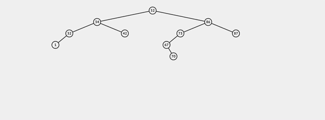

# Binary Search Trees

## Overview

Our Linked Lists are a linear structure with each node linking to the next node in the structure.


*Fig. 1. Linked List Diagram*

Our Node class from the LinkedList topic, which will be referred to as `ListNode`, looked like this:

```python
class ListNode:
    def __init__(self, value, next=None):
        self.data = value
        self.next = next
```

The `ListNode` class was used in a larger `LinkedList` class which maintained a chain of `ListNode` objects starting with a node pointed to by an instance variable called `head`.

### Consider A Nonlinear Structure

In a _Binary Search Tree_ each node's left pointer points to all elements smaller than or equal to the node's key.  The right pointer points to all nodes greater than the given node's key.   Each node can refer to other nodes.  A Tree is hierarchical with certain nodes acting as parents to others.  A node above another is the node's _parent_.  The node(s) below a node are it's _children_.  The topmost node in a tree is known as the _root_.  The nodes with no children are called _leaves_.

In a Binary Search Tree:

- Nodes with values less than any node are stored to the **left** of that node.
- Nodes with values greater than any node are stored to the **right** of that node. 


### Binary Search Tree Node

Instead of a node with one link to a next node, we can create nodes with 2 pointers, left and right.  Since each node can have 2 successors or "children", it forms a binary structure as opposed to the linear structure of a Linked List.

This node stores both a key and value for each node.  The `Tree` class will compare keys to maintain node order.

```python
class TreeNode:
    def __init__(self, key, val = None):
        if val == None:
            val = key

        self.key = key
        self.value = val
        self.left = None
        self.right = None```
```

### The Tree Class

Just like the `LinkedList` class discussed above, we can create a `Tree` class to represent the full data structure, using the `TreeNode` class to create nodes and build the tree.

```python
class Tree:
    def __init__(self):
        self.root = None # The root is the starting
                  # node in the Tree
    # Tree methods go here...
```

### Insertion - O(log n)

The _root_ is where the tree begins, the topmost node.  New nodes as they are added are placed to the left or a given node, if they are less than or equal to the current node, and to the right if they are greater than the current node.  This is a natually recursive process.

```
Method add:
  if the root is nil set the root to be a new node with the given value and return the node.

  Otherwise:
    if the value is less than or equal to the current node's value, make the current node's left be the result of calling add on root's left.
    otherwise make node's right be the result of calling add on node's right.
```


_Fig.  Visualization of inserting a value into a BST_

You can experiment with this in the [Binary Tree Visualizer](https://visualgo.net/en/bst)

### Deletion - O(log n)

To delete a node from a binary search tree we must first find the node to delete.  This is an O(log n) operation.  Once we find the node we can delete it by changing the references.

```
Method delete(current_root, key):
    if the root is none return none
  
    Otherwise, recur down the tree
        if the key is less than the root's key delete the node in the left subtree.
            current_root.left = delete(current_root.left, key);
        otherwise if the key is greater than root's key delete the node in the right subtree.
            current_root.right = delete(current_root.right, key);


        Otherwise if the current root is the node to be deleted
        
            if the left child is none
                return current_root.right
            otherwise if current_root.right == none
                return current_root.left;

            Otherwise find the minimum node in the right subtree
            smallest_node_on_right = min_node(root.right);
            current_root.key = smallest_node_on_right.key;
            current_root.value = smallest_node_on_right.value;

            // Delete the inorder successor
            root.right = delete(root.right, root.key);

    return current_root;
```

### Searching - O(log n)

You can try to search to find a value in a Binary Search Tree Like this:

```
Start the current node at the root
If the current node is nil return nil
If the current node equals the value 
    being searched for return the current
    node's data

If the value is less than the current node 
    return search on current node's left side
If the value is greater than the root 
    return search on current node's right side
```

### Finding A Node With Python



_Fig.  A visualization of finding a value in a BST._

You can implement the `find` method in Python as follows:

```python
class Tree:
    def __init__(self):
        self.root = None
    
    def find(self, key):
        current = self.root

        while current != None:
            if current.key == key:
                return current.value
            elif key < current.key:
                current = current.left
            else:
                current = current.right

        return None
```

### Recursive Find Method

Because every node in a Binary Search Tree is the root of a subtree, you can take advantage of the recursive structure to write a recursive solution.

```python
class Tree:
    def __init__(self):
        self.root = None
    
    def find_helper(self, current, value):
        if current == None:
            return None
        elif current.data == value:
            return current.value
        elif value < current.data:
            return self.find_helper(current.left, value)

        return self.find_helper(current.right, value)

    def find(self, value):
        return self.find_helper(self.root, value)
```

### Exercise

Try this out on the [Binary Tree Visualizer](https://visualgo.net/en/bst).

**Question**:  If you have a tree of height 5, what's the worst-case for finding a value in the tree?  What affects the number of comparisons you need to make?

<details style="max-width: 700px; margin: auto;">
  <summary>
    Open this to see our answer.
  </summary>

  Worst-case, you need to make comparisons to 5 nodes before inserting.  This occurs when you need to insert a new node into a leaf.

  Worst-case:  O(h) comparisons where _h_ is the height of the tree
</details>

## Balanced Trees & Unbalanced Trees

A tree is considered **balanced** if the levels of any two leaves differ by at most 1.  In this way the nodes in the tree must be spread fairly evenly.

This is an example of a balanced tree.


On the other hand this is an unbalanced tree.


### !callout-warning

## Tree Balance & Time Complexity

Assume that we are using the Binary Search tree methods as we have described them here.  If all the nodes were inserted in order, the worst case time complexity would be O(n) because each node except the root would be the left child of the previous nodes if the nodes were inserted in descending order, or the right child of the previous node if they were inserted in ascending order.  The tree would be **unbalanced**.  There are more advanced algorithms that can be used to create self-balancing trees.

* If a tree is unbalanced it's time complexities for Insertion, Deletion, and searching approach O(n).
* If a tree is balanced it's time complexities for Insertion, Deletion, and searching are O(log n).

Therefore it is very important that a tree **remain balanced**.

### !end-callout

### !challenge

* type: number
* id: 476cab10-a81f-4877-aad3-682602a3c30d
* title: How many nodes do you need to examine to find 5, in the 1st example?
* decimal: 0
* points: 1
* topics: bst

##### !question

How many nodes do you need to examine to find 5, in the 1st example?

##### !end-question

##### !placeholder

put a number in here

##### !end-placeholder

##### !answer

3

##### !end-answer


### !end-challenge

<!-- ======================= END CHALLENGE ======================= -->

<!-- >>>>>>>>>>>>>>>>>>>>>> BEGIN CHALLENGE >>>>>>>>>>>>>>>>>>>>>> -->

### !challenge

* type: number
* id: 5a4ce281-7f17-47e5-961e-a582171eb3be
* title: How many nodes to check in the 2nd example?
* decimal: 0
* points: 1
* topics: bst

##### !question

How many in the 2nd?

##### !end-question

##### !placeholder

Number goes here

##### !end-placeholder

##### !answer

5

##### !end-answer


### !end-challenge

<!-- ======================= END CHALLENGE ======================= -->


<!-- >>>>>>>>>>>>>>>>>>>>>> BEGIN CHALLENGE >>>>>>>>>>>>>>>>>>>>>> -->

### !challenge

* type: number
* id: b7d69d24-04e0-4891-beaa-ccbb81f73fed
* title: 5 level tree
* decimal: 0
* points: 1
* topics: bst

##### !question

With the [Binary Tree Visualizer](https://visualgo.net/en/bst), build a **balanced** tree with a height of 5 levels.  How many comparisons do you need to make to find a particular leaf node?

##### !end-question

##### !placeholder

Number goes here

##### !end-placeholder

##### !answer

5

##### !end-answer

### !end-challenge

<!-- ======================= END CHALLENGE ======================= -->

<!-- >>>>>>>>>>>>>>>>>>>>>> BEGIN CHALLENGE >>>>>>>>>>>>>>>>>>>>>> -->

### !challenge

* type: number
* id: 0dd499dc-7260-4d51-aabd-b9f4560e1047
* title: 6 level tree
* decimal: 0
* points: 1
* topics: bst

##### !question

Add 5 more nodes to the balanced tree, maintaining the balance.  How many comparisons do you need to make now to find a particular leaf node?

##### !end-question

##### !placeholder

Number goes here

##### !end-placeholder

##### !answer

6

##### !end-answer

<!-- other optional sections -->
##### !hint 

How many levels does adding 5 nodes add, if you maintain balance?

##### !end-hint

### !end-challenge

<!-- ======================= END CHALLENGE ======================= -->

<!-- >>>>>>>>>>>>>>>>>>>>>> BEGIN CHALLENGE >>>>>>>>>>>>>>>>>>>>>> -->

### !challenge

* type: number
* id: f32167e5-2264-49bc-8850-f81afd0f697b
* title: Unbalanced 5 level tree
* decimal: 0
* points: 1
* topics: bst

##### !question

Build a **completely unbalanced** tree with 5 levels.  How many comparisons to find a leaf node?

##### !end-question

##### !placeholder

Number here

##### !end-placeholder

##### !answer

5

##### !end-answer

<!-- other optional sections -->
##### !hint

What's the worst case?

##### !end-hint
<!-- !rubric - !end-rubric (markdown, instructors can see while scoring a checkpoint) -->
##### !explanation

Worst-case you have to travel to the last node in the chain and since there are 5 levels, it takes 5 comparisons

##### !end-explanation

### !end-challenge

<!-- ======================= END CHALLENGE ======================= -->

<!-- >>>>>>>>>>>>>>>>>>>>>> BEGIN CHALLENGE >>>>>>>>>>>>>>>>>>>>>> -->
<!-- Replace everything in square brackets [] and remove brackets  -->

### !challenge

* type: number
* id: a97fce91-ee27-4f04-be01-7484247a236e
* title: Adding 4 more unbalanced nodes
* decimal: 0
* points: 1
* topics: bst

##### !question

What if you added 4 nodes and kept the tree unbalanced. How many more comparisons would you need to make?

##### !end-question

##### !placeholder

Number goes here 

##### !end-placeholder

##### !answer

9

##### !end-answer

<!-- other optional sections -->
##### !hint

If you have 5 levels and add 4 more nodes, how many levels do you gain if the tree is totally unbalanced?

##### !end-hint

##### !explanation

Worst case you added 4 more levels 5 + 4 = 9, so 9 comparisons to find the value.

##### !end-explanation

### !end-challenge

<!-- ======================= END CHALLENGE ======================= -->

<!-- >>>>>>>>>>>>>>>>>>>>>> BEGIN CHALLENGE >>>>>>>>>>>>>>>>>>>>>> -->

### !challenge

* type: short-answer
* id: 78ea3ad2-2a41-496b-af4a-535720e0e4f4
* title: Growth as `n` changes
* points: 1
* topics: bst

##### !question

Create a tree with one node.  Then double the number of nodes, **keeping the tree balanced.**  Then double the number of nodes again, maintaining balance.  Notice how the height changes.

What standard Big-O time complexity does this match?
  

##### !end-question

##### !placeholder

O(?)

##### !end-placeholder

##### !answer

/O\(log n\)/

##### !end-answer

<!-- other optional sections -->
##### !hint 

Answer in the form of O(n), O(nlog n) or O(log n) etc

##### !end-hint
<!-- !rubric - !end-rubric (markdown, instructors can see while scoring a checkpoint) -->
##### !explanation 

O(log n) when you double the number of nodes, the height increases by 1.

##### !end-explanation

### !end-challenge

<!-- ======================= END CHALLENGE ======================= -->

Notice if a tree is balanced, when you move left or right, you eliminate half of the possible nodes.  This means you are essentially doing **binary search.**  If the tree is unbalanced, you are performing a linear search.

<!-- available callout types: info, success, warning, danger, secondary, star  -->
### !callout-star

## Balance is important in a tree's efficiency

If a tree is _balanced_ then adding, finding, removing operations on a that tree perform in O(log n) time.  However if a tree becomes unbalanced the efficiency can approach O(n) time complexity.  

For this reason, computer scientists spend a lot of time focusing on ways to maintain the balance of a Binary Search Tree.

### !end-callout

**Self-Balancing Trees** There are a lot of algorithms for [keeping a tree balanced](https://en.wikipedia.org/wiki/Self-balancing_binary_search_tree).  The act of keeping a tree balanced is also O(log n), and so rebalancing a tree after an insertion or deletion doesn't significantly impact the runtime of a binary search tree.  These structures are wonderful things to learn, but beyond the scope of this class.  You **can** however rest assured that any library tree classes that you use will keep the tree balanced in such a manner.

## Summary

In this lesson we looked at the advantages a Binary Search Tree provides over a sorted array or LinkedList.  Binary Search trees provide an O(log n) time to add, remove and find elements because searching a tree performs a binary search.  This performance however depends on the tree being **balanced**.  A balanced tree has subtrees of height within 1 of each other.

In short we want to use a Binary Search Tree When:

- Maintaining order is important
- We want to maintain efficient search, insertion and deletion time complexities

## Big-O Comparison

We can see below a balanced Binary Search Tree provides good performance while maintaining elements in order.  

**#**|**Data Structure**|**Access By Key**|**Search**|**Insertion (Middle)**|**Deletion (Middle)**|**Add First**|**Add Last**
:-----:|:-----:|:-----:|:-----:|:-----:|:-----:|:-----:|:-----:
1|Unsorted Array|O(1)|O(n)|O(n)|O(n)|O(n)|O(1)
2|Sorted Array|O(1)|O(log n)|O(n)|O(n)|O(n)|O(1)
3|Linked List|O(n)|O(n)|O(n)|O(n)|O(1)|O(1)
4|Binary Tree (balanced)|O(log n)|O(log n)|O(log n)|O(log n)|NA|NA
5|Hash Table|O(1)|O(1)|O(1)|O(1)|NA|NA