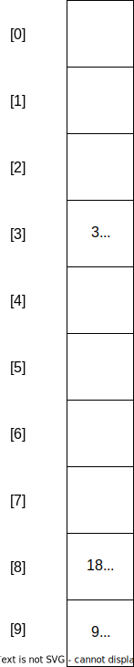

# Activity:  Hash tables

## Goal

Our goal is to be able to:

- Use dictionaries and hash tables to solve coding problems
- Explain how hash tables work including
    - Collision resolution
    - Hash Functions
- Explain the uses for Hash Tables

## Review Hash Tables Lesson

<!-- >>>>>>>>>>>>>>>>>>>>>> BEGIN CHALLENGE >>>>>>>>>>>>>>>>>>>>>> -->

### !challenge

* type: checkbox
* id: e39fee61-4bf4-4361-a598-3ce3d719950e
* title: Where are Hash Tables useful?
* points: 1
* topics: hash-tables, big-o

##### !question

What are advantages of a Hash Table/dictionary?

##### !end-question

##### !options

* Fast insertion speed `O(log n)`
* Fast removal speed `O(log n)`
* Uses less space than a Linked List or Array
* Fast O(1) lookup speed
* Fast O(1) insertion speed
* Maintains the order of elements

##### !end-options

##### !answer

* Fast O(1) lookup speed
* Fast O(1) insertion speed

##### !end-answer

##### !hint

Remember that a well-functioning hash table is one who's hash function executes in O(1) time and rarely causes collisions.

##### !end-hint

### !end-challenge

<!-- ======================= END CHALLENGE ======================= -->

<!-- >>>>>>>>>>>>>>>>>>>>>> BEGIN CHALLENGE >>>>>>>>>>>>>>>>>>>>>> -->

### !challenge

* type: multiple-choice
* id: c94f0705-4561-43b6-9ab7-8f6662fd2261
* title: Explain How Linear Probing works
* topics: hash-tables

##### !question

In the given Hash Table, the hash function is `h(key) = key % size`.  Where `size` is the length of the internal array and `key` is the key to be hashed.

When the key is `28` at what index will the key be inserted assuming linear probing is the collision resolution method?

##### !end-question

##### !options

* 0
* 1
* 7
* 8
* 9

##### !end-options

##### !answer

* 0

##### !end-answer

##### !explanation

Because the hash function 28 % 10 = 8, we have a collision.  Using linear probing we iterate through the array until we find an empty slot.

##### !end-explanation

### !end-challenge

<!-- ======================= END CHALLENGE ======================= -->

<!-- >>>>>>>>>>>>>>>>>>>>>> BEGIN CHALLENGE >>>>>>>>>>>>>>>>>>>>>> -->

### !challenge

* type: paragraph
* id: 0a9a796c-f00a-4522-84c7-90ff25ba2a7b
* title: How is quadratic probing different?
* points: 1
* topics: hash-tables

##### !question

In your own words, how is quadratic probing different from linear probing?

##### !end-question

##### !placeholder

How does quadratic probing differ?

##### !end-placeholder

##### !explanation

Quadratic probing applies a formula to the hash function to find the next index to insert the key.  The formula is something like `h(key) = (key + i^2) % size`.  This formula is used to find the next index to insert the key.  The advantage is that it can lead to less clustering of keys.  

##### !end-explanation

### !end-challenge

<!-- ======================= END CHALLENGE ======================= -->

<!-- >>>>>>>>>>>>>>>>>>>>>> BEGIN CHALLENGE >>>>>>>>>>>>>>>>>>>>>> -->
<!-- Replace everything in square brackets [] and remove brackets  -->

### !challenge

* type: checkbox
* id: 34014e28-0d90-499d-a082-47683473f6a3
* title: Where are situations where a hash table is in appropriate?
* topics: hash-tables

##### !question

In which situations would you **not** use a hash table/dictionary?

##### !end-question

##### !options

* When lookup times need to be fast
* When order matters
* When multiple items can have the same key
* When memory consumption is important

##### !end-options

##### !answer

* When order matters
* When multiple items can have the same key
* When memory consumption is important

##### !end-answer

##### !hint

Remember the hash function is a function that takes a key and returns a seemingly *arbitrary* index, so two elements with similar keys may end up in vastly dissimilar indicies in the internal array.

Also the hash table must maintain an array much larger than the number of elements stored inside.

##### !end-hint

### !end-challenge

<!-- ======================= END CHALLENGE ======================= -->

## Livecode - Project Introduction

As a class we will check out  the [project](./02-hash-table-checkpoint.md).  We won't solve the problems in a livecode, but will introduce the two problems.

### Leetcode Style Question

In the next activity we will practice an interview question using a dictionary.

- [4 Sum](https://replit.com/@adadev/4Sum-II)

Looking at the brute force solution would require iterating with nested loops through all 4 arrays resulting in O(n^4) time complexity. We can use a hash table to improve this result to O(n^2) time complexity by finding the sums for each element in the first two arrays and the sums of all the elements in the 2nd and 3rd array.

Then we can find the inverse of the keys in one dictionary in the other dictionary.

## Activity - Group Practice

- [Inflight Entertainment](https://replit.com/@adadev/Inflight-Entertainment)
- [Longest Palindrome](https://replit.com/@adadev/Longest-Palindrome-by-Concatenating-Two-Letter-Words#README.md)

### Getting Started

In small groups of 3-4, **one student** will *fork* the given replit and then share a collaboration link with the rest of the team.

### Exercise

As a team complete the method in the replit.

If you finish early, you can depart the session or work on the project, with instructor support available.

### !callout-secondary

## Suggestion:  Start The Project Now

It can be a *really* good idea to start the project with classmates and instructional staff around to ask questions of. Getting a solid start to a project makes the entire thing go easier.

### !end-callout