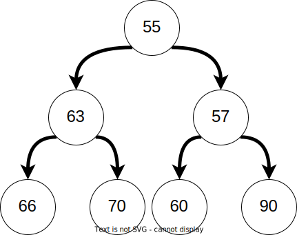
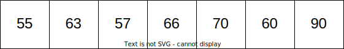
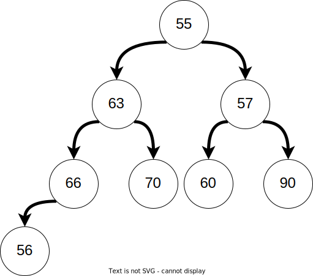

# Activity:  Heaps Activity

## Goal

Our goal is to be able to:

- Explain how a heap maintains O(log n) insert and removal time complexity.
- Describe the organization of a heap using an internal array
- Implement a Heap Data Structure
- Use heaps to solve coding problems

## Review Heaps Lesson

<!-- >>>>>>>>>>>>>>>>>>>>>> BEGIN CHALLENGE >>>>>>>>>>>>>>>>>>>>>> -->

### !challenge

* type: checkbox
* id: 9dc21e95-96ef-488c-90aa-7df6c7f25e7c
* title: Where are Binary Search Trees useful?
* points: 1
* topics: heaps, big-o

##### !question

What are advantages of a Heap?

##### !end-question

##### !options

* Fast insertion speed `O(log n)`
* Fast removal speed `O(log n)`
* Uses less space than a Linked List or Array
* Fast O(1) lookup speed
* Fast O(1) insertion to the head and tail
* Ability to remove the highest or lowest element (depending on the type of Heap) in `O(log n)` time complexity

##### !end-options

##### !answer

* Fast insertion speed `O(log n)`
* Fast removal speed `O(log n)`
* Ability to remove the highest or lowest element (depending on the type of Heap) in `O(log n)` time complexity

##### !end-answer

##### !hint

Heaps are also known as _priority queues_.  A priority queue is a data structure which allows the user to remove the element with the highest priority.

##### !end-hint

### !end-challenge

<!-- ======================= END CHALLENGE ======================= -->

<!-- >>>>>>>>>>>>>>>>>>>>>> BEGIN CHALLENGE >>>>>>>>>>>>>>>>>>>>>> -->

### !challenge

* type: multiple-choice
* id: 8a0488a9-7a3e-47bc-82d5-e72f6fcb9f62
* title: What type of heap is this?
* points: 1
* topics: heaps

##### !question

The following is a heap drawn as a binary tree.  What type of heap is illustrated

##### !end-question

##### !options

* Min Heap
* Max Heap
* Binary Search Tree

##### !end-options

##### !answer

* Min Heap

##### !end-answer

##### !explanation

In a min heap each node is _smaller_ than it's children.

##### !end-explanation

### !end-challenge

<!-- ======================= END CHALLENGE ======================= -->

<!-- >>>>>>>>>>>>>>>>>>>>>> BEGIN CHALLENGE >>>>>>>>>>>>>>>>>>>>>> -->

### !challenge

* type: multiple-choice
* id: 8e3c704d-da93-41f2-946a-0002d90e612a
* title: What index should a value be located at?
* points: 1
* topics: heaps

##### !question

Often elements of a heap are stored in an array. If the following heap elements are stored in an array, what index should the value `60` be located at?

##### !end-question

##### !options

* 0
* 1
* 2
* 3
* 4
* 5

##### !end-options

##### !answer

* 5

##### !end-answer

##### !explanation

This is the heap represented as an array.

##### !end-explanation

### !end-challenge

<!-- ======================= END CHALLENGE ======================= -->

<!-- >>>>>>>>>>>>>>>>>>>>>> BEGIN CHALLENGE >>>>>>>>>>>>>>>>>>>>>> -->

### !challenge

* type: multiple-choice
* id: 2b8d82f1-7ab9-40bc-ba17-0c7b2c931471
* title: What should the heap look like after an insertion?
* points: 1
* topics: heaps

##### !question

If we inserted `56` into the heap, at what index would the new node end up at?

##### !end-question

##### !options

* 0
* 1
* 2
* 3
* 4
* 5

##### !end-options

##### !answer

* 1

##### !end-answer

##### !explanation

The node `56` would initially be inserted here.

Then the node would "heap-up" until it finds a parent smaller than itself resulting in this.

##### !end-explanation

### !end-challenge

<!-- ======================= END CHALLENGE ======================= -->

<!-- >>>>>>>>>>>>>>>>>>>>>> BEGIN CHALLENGE >>>>>>>>>>>>>>>>>>>>>> -->

### !challenge

* type: paragraph
* id: 33d12b08-695a-48cb-ba73-8a6bdb21febb
* title: Describe what happens when a node is removed from a heap?
* points: 1
* topics: heaps

##### !question

What happens when a node is removed from the heap?

##### !end-question

##### !placeholder

Uses for heaps

##### !end-placeholder

##### !explanation

A heap makes an efficient data structure to always provide the next priority item, allowing you to handle issues by priority.

For example you could have a priority queue which takes in jobs to complete and then handle the highest priority tasks first.

##### !end-explanation

### !end-challenge

<!-- ======================= END CHALLENGE ======================= -->

<!-- >>>>>>>>>>>>>>>>>>>>>> BEGIN CHALLENGE >>>>>>>>>>>>>>>>>>>>>> -->

### !challenge

* type: paragraph
* id: b6d0828f-d3c3-416d-8d1b-7bcee70445ed
* title: When can heaps be useful in coding problems?
* points: 1
* topics: heaps

##### !question

When can heaps be useful in coding problems?

##### !end-question

##### !placeholder

Uses for heaps

##### !end-placeholder

##### !explanation

A heap makes an efficient data structure to always provide the next priority item, allowing you to handle issues by priority.

For example you could have a priority queue which takes in jobs to complete and then handle the highest priority tasks first.

##### !end-explanation

### !end-challenge

<!-- ======================= END CHALLENGE ======================= -->

## Livecode - Project Introduction

As a class we will check out  the [project](./02-heaps-exercise-checkpoint.md) and work through a couple of the methods.  The purpose is to gain familiarity with the project and to discuss how to implement a heap.

Walkthrough with:

- Constructor
- Add Node (recursive & Iterative)

Discuss the following:

- `heap_up`
- `heap_down`

## Python Library Reference `heapq`

The [`heapq` module](https://docs.python.org/3/library/heapq.html) provides the Python library's standard way to implement a min-heap. Do **not** use this module for the project, but you *can* use it on other coding problems.

`heapq` provides a non-object-oriented approach to heap implementation which is different from that in the project.

Lets take a minute to read the documentation and answer a few questions.

1. How can you build a heap using `heapq`?
1. How do you add elements to the heap?
1. How do you remove elements from the heap?
1. Can you turn an unsorted list into a heap?
1. What are the time complexities involved?

### Leetcode Style Question

In the next activity we will examine a coding problem using a heap to solve a problem.

- [Find K Pairs with Smallest Sums](https://replit.com/@adadev/Find-K-Pairs-with-Smallest-Sums#k_pairs/k_pairs.py)

## Activity - Group Work Linked List Methods

- [Merge K Sorted lists](https://replit.com/@adadev/Merge-K-Sorted-Lists)
  - Use a heap to solve this problem, you can use the `heapq` module.

<!-- available callout types: info, success, warning, danger, secondary, star  -->
### !callout-star

## Why might a Priority Queue be appropriate here?

Why does your team thing a priority queue is appropriate here?

### !end-callout

### Getting Started

In small groups of 3-4, **one student** will *fork* the given replit and then share a collaboration link with the rest of the team.

### Exercise

As a team complete the method in the replit.

If you finish early, you can depart the session or work on the project, with instructor support available.

### !callout-secondary

## Suggestion:  Start The Project Now

It can be a *really* good idea to start the project with classmates and instructional staff around to ask questions of. Getting a solid start to a project makes the entire thing go easier.

### !end-callout