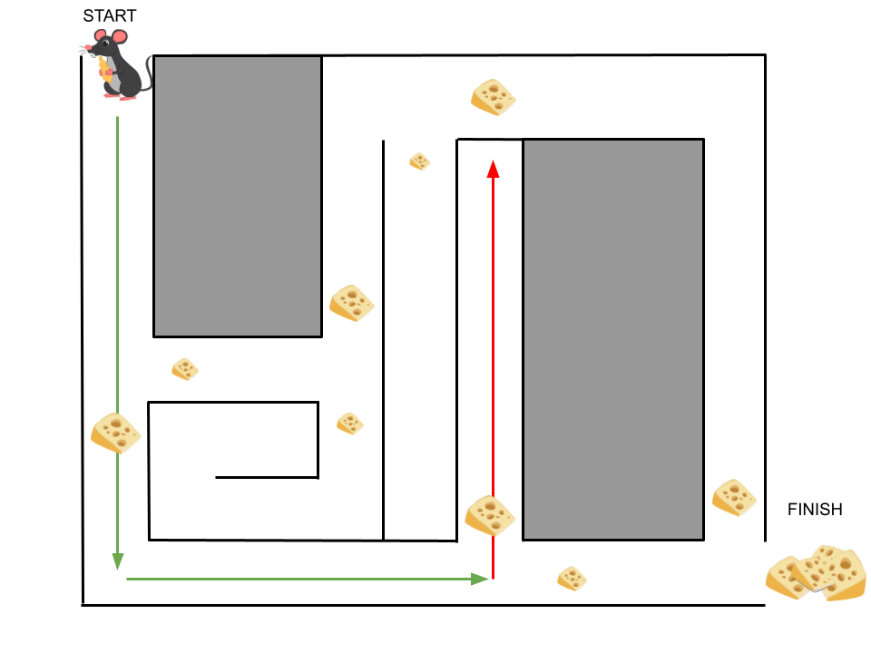
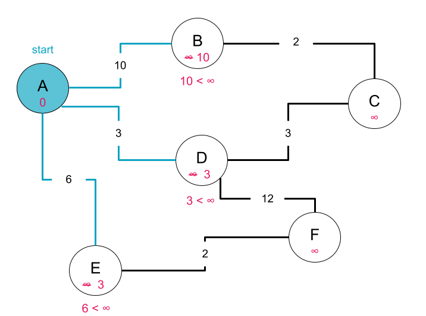
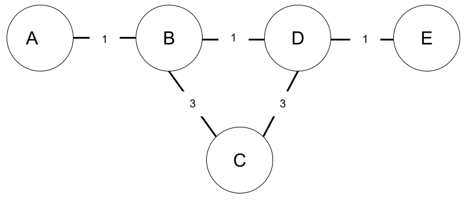
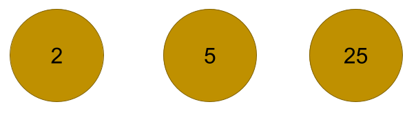
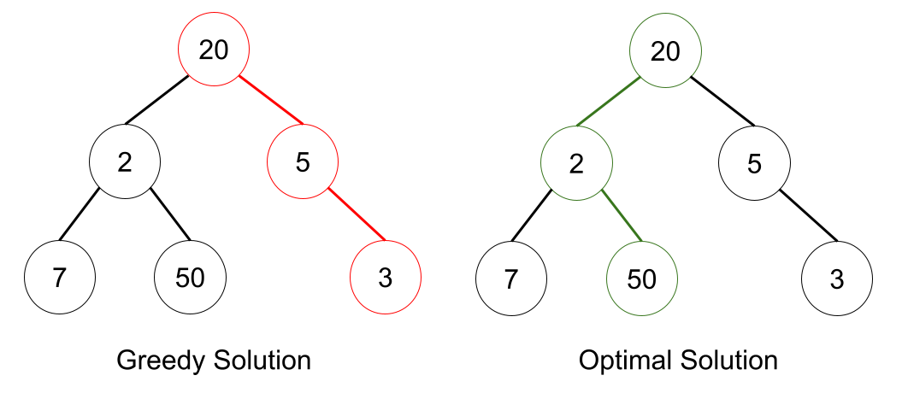

# The Greedy Approach

## Introduction
The divide and conquer approach won't work for all problems so it is useful to be familiar with additional techniques we can use to develop algorithms. **Greedy Algorithms** or the greedy approach is another handy strategy and is often used to solve optimization problems.

We can think of a greedy algorithm as a mouse moving through a maze filled with cheese. At each decision point in the maze, the mouse will choose the path that provides the tastiest cheese. The mouse can't see the entire problem; it chooses its path using only the information available at the moment (which fork in the road offers the tastier cheese?)
without regard for future consequences. Greedy algorithms _hope_ that by making a locally optimal choice at each step, they arrive at an optimum solution for the larger problem, but it does not always work out.

In the diagram below, we can see that the mouse successfully makes it out of the maze by using the greedy approach. 


However, if a maze route that ended in a dead-end offered tastier cheese, the mouse could just as easily end up lost in the maze!



## Applications of Greedy Algorithms

Although greedy algorithms don't always provide the most optimal or even correct solution there are many cases where they do!

We have actually already seen a successful greedy algorithm in practice. [Dijkstra's Algorithm](./../09-graphs-p2/02-dijkstra.md) uses a greedy approach and is proven to always return the shortest path between two connected nodes in any graph with non-negative weights.

### Dijkstra's as a Greedy Algorithm

Why is Dijkstra's a greedy algorithm? 

Let's first recall how Dijkstra's works. At a high level, Dijkstra's works by initially overestimating the distance from the start node to every other node in the graph. Then, as the algorithm traverses the graph and finds new paths to each destination node, it uses the weights of the edges of these new paths to revise its estimates for the shortest distance to each destination node.

In the example below, the shortest distance to nodes B, D, and E were all estimated as infinity. But as the algorithm traverses the edges from the start node A to each of these B, D, and E, it sees that there is a shorter path available and updates the estimates accordingly. 



What makes Dijkstra's a greedy algorithm is the order in which it conducts its traversal of the graph. At each step, Dijkstra's chooses which node to visit next by picking the node that is _currently least expensive to visit_. Since we are trying to find the minimum cost path, this is the optimal choice at that point. At each step in the traversal, Dijkstra's doesn't necessarily have all information about the weights of every edge in the graph and all possible paths to each node, making its choices locally optimal decisions. It doesn't consider how paths beyond what it has looked at so far will impact the solution.

In the example below, Dijkstra's chooses to visit Node D next because it is currently estimated to be the closest of all the unvisited nodes.


For a more detailed review of Dijkstra's, take a look at the pseudocode below.

<details>
   <summary>Dijkstra's Pseudocode</summary>

```
- Create a distances list equal in length to the number of nodes in the graph
    - Tracks the minimum cost/distance from start node to each node in graph
    - Initialize each value to infinity
    - Initialize distances[start_node] to zero
- Create a previous list equal in length to the number of nodes in the graph
    - Tracks the previous node in each node's shortest/minimum cost path
    - Initialize each value to None since we have not yet traversed any paths
- Create a visited list to track which nodes have already been visited
- Create a priority queue and add the start node to it
- While the queue is not empty:
    - Set current as node in the queue with minimum cost
    - Add current to the list of visited nodes
    - loop through all the current node's neighbors
        - if the neighbor has not yet been visited:
            - calculate distance from start node to neighbor via current node
            - If calculated distance < distance[neighbor]
                - distance[neighbor] = calculated distance
                - previous[neighbor] = current_node
            - queue.append(neighbor)
- Return the previous and distances list
```

</details>

### Generalizing Greedy Algorithms

We mentioned previously that the greedy approach works well for some problems but not all problems. How do we know when greedy algorithms will be successful? Most problems which can be solved with a greedy algorithm will have the following two characteristics.

#### Greedy Choice Property

Greedy algorithms follow the **greedy choice property** which says that the globally optimal solution to a problem can be found by making the best choice available to it in the moment for the current subproblem. Choices can be made based on information that has been gathered thus far but may not depend on future choices or consider solutions that have not yet been explored. After making the locally optimal choice, the algorithm never looks back and reconsiders that choice. It only moves forward with making new choices.

We have already noted that Dijkstra's makes the greedy choice at each step by choosing the node it believes is least far from it in the moment. In making this choice, it considers the edges and nodes it has traversed thus far to evaluate which unvisited node is the next nearest. However, it does not try and peek at paths beyond those it has already traversed or whether the estimated distance for any of the unvisited nodes will change in the future. 

Notice in the example below, it will choose Node D next because after traversing the edges of the current node, Node A, it finds Node D is the nearest node to the start node, also Node A. However, it doesn't consider whether the distance to other nodes will ultimately be updated. Note that it currently thinks the distance to Node B is 10, when the actual shortest distance from Node A to Node B is 8. 


Once Dijkstra's visits a node, the path to that node is set. Per the greedy choice property, Dijkstra's never goes back and revisits that node. While there are other paths to Node D, they won't be considered because Dijkstra's only ever considers revising the minimum path when looking at the current node's _unvisited_ neighbors. 

In the visualization of Dijkstra's below, observe that the distance to a node does not change once it has been visited. 


### Optimal Substructures
Most algorithms where the optimal solution is greedy will be **optimal substructure** problems. A problem with an optimal substructure is one in which the optimal solution to the overall problem is made up of the optimal solution to each of its subproblems.

For Dijkstra's, observe that the optimal path between two nodes is made up of optimal paths between any intermediary nodes. 

In the example below, the shortest path from Node A to Node E contains intermediary nodes B & D. It is made up of the following subpaths:
- Node A to Node B
- Node B to Node D
- Node D to Node E



Notice that the path from Node A to Node E is made up of the optimal solution for each subpath. In particular, observe that the optimal solution for the minimum cost path from Node B to Node D is the direct edge between the two nodes rather than the path from Node B -> Node C -> Node D. Likewise, the overall solution uses the direct edge from Node B to Node D and ignores Node C.

### Developing Greedy Algorithms 

Greedy algorithms are most often applied to optimization problems. Combined with the greedy choice and optimal substructure properties, let's take a look at how we can apply the greedy technique to a problem. 

#### The Coin Change Problem 

Say we have some set of different coin types and infinite supply of each coin type. We are given a target sum and would like to choose coins to total that sum. Return a list of the minimum number of coins needed to make up the target sum. If it is impossible to produce that sum with the provided coins, return an empty list. 

##### Example Input 1

<br>
Input: `coins = [1, 2, 5, 25, 50, 100]`, `target_sum = 157`
Output: `[100, 50, 5, 2]`

##### Example Input 2

<br>
Input: `coins = [25, 2, 5]`, `target_sum = 3`
Output: `[]`


Observe that this problem is an optimization problem - we are trying to produce a sum of money using the least possible amount of coins. 

Now, think about how we may solve this problem in real life. If we are asked to come up with some amount of money in change, we often search for the largest coins we have that are less than the total amount. We then continue to find the largest coins available that are less than the remaining amount we need to produce until we have come up with the total.

Notice that the above approach is greedy! At each step, it chooses the maximum or best value available at the moment. After choosing the biggest coin still under the target sum, we have a new sub-target: the original target sum minus the chosen coin value. We continue choosing the biggest coin available under our sub-target until our sub-target reaches 0 or there are no available coins less than (our target is impossible to reach with the available coins).

At each step, we're following the greedy choice property, making the optimal choice for the local sub-problem without considering future subproblems, and it seems like this is an optimal substructure problem. The optimal list of coins to achieve any sub-target will make up the optimal solution to the overall target sum.


Now we can develop this into pseudocode:
```
- Sort our list of coins to make it easier to find the largest coin.
- Create an empty result list
- Find the biggest coin that is less than the target sum
- Add the coin to the result list
- Subtract the added coin's value from the target sum to get the pending amount
- If the pending amount is 0, return the result list
- If the pending amount is less than the smallest coin, return an empty list
```

**Try implementing the algorithm below. Spend no more than 15 minutes on this**
<!-- >>>>>>>>>>>>>>>>>>>>>> BEGIN CHALLENGE >>>>>>>>>>>>>>>>>>>>>> -->
<!-- Replace everything in square brackets [] and remove brackets  -->

### !challenge

* type: code-snippet
* language: python3.6
* id: 8d039ded-3590-4d4b-b01d-2e6e6f5c251f
* title: Coin Change Problem
* points: 1

##### !question

Using the pseudocode and solution outlined above, implement a greedy solution to the coin change problem.

Provided a list of kinds of coins `coins` and a target sum `target`, return a list of the minimum number of coins needed to produce the `target`. If it is impossible to produce that sum with the provided coins, return an empty list. 

##### !end-question

##### !placeholder
```py
def coin_change(coins, target):
    pass
```

##### !end-placeholder

##### !tests

```py
import unittest
from main import *

class TestPython1(unittest.TestCase):
    def test_example_one(self):
        # Arrange
        coins = [1, 2, 4, 25, 50, 100]
        target_sum = 156
        expected = [2, 4, 50, 100]

        # Act
        answer = coin_change(coins, target_sum)
        answer.sort()

        # Assert
        self.assertEqual(answer, expected)

    def test_example_one_unsorted_array(self):
        # Arrange
        coins = [4, 2, 1, 25, 100, 50]
        target_sum = 156
        expected = [2, 4, 50, 100]

        # Act
        answer = coin_change(coins, target_sum)
        answer.sort()

        # Assert
        self.assertEqual(answer, expected)

    def test_returns_empty_list_for_target_sum_of_zero(self):
        # Arrange
        coins = [4, 2, 1, 25, 100, 50]
        target_sum = 0
        expected = []

        # Act
        answer = coin_change(coins, target_sum)
        answer.sort()

        # Assert
        self.assertEqual(answer, expected)

    def test_returns_empty_list_for_impossible_target_sum(self):
        # Arrange
        coins = [25, 2, 5]
        target_sum = 3
        expected = []

        # Act
        answer = coin_change(coins, target_sum)
        answer.sort()

        # Assert
        self.assertEqual(answer, expected)
    
    def test_ignores_large_coin_values_over_target_sum(self):
        #Arrange
        coins = [100, 1000, 50000]
        target_sum = 100
        expected = [100]

        # Act
        answer = coin_change(coins, target_sum)
        answer.sort()

        # Assert
        self.assertEqual(answer, expected)

    def test_reuses_coins(self):
        # Arrange
        coins = [25, 5, 1000]
        target_sum = 105
        expected = [5, 25, 25, 25, 25]
                
        # Act
        answer = coin_change(coins, target_sum)
        answer.sort()

        # Assert
        self.assertEqual(answer, expected)

    def test_only_one_coin_type(self):
        coins = [10]
        target_sum = 20
        expected = [10, 10]

        # Act
        answer = coin_change(coins, target_sum)
        answer.sort()

        # Assert
        self.assertEqual(answer, expected)
```

##### !end-tests

<!-- other optional sections -->
##### !hint
In a sorted list the largest coin will be at index -1. Start there and work your way backwards! 

Still feeling stuck? Watch this video walkthrough of the solution.

Please note, the video includes an incorrect analysis of the time complexity for this algorithm. The time complexity ought to be O(nlogn). You can see an explanation for the time complexity after submitting an answer for the time complexity below.
<br>
<iframe src="https://adaacademy.hosted.panopto.com/Panopto/Pages/Embed.aspx?id=cf6f6fa0-a470-49ad-911b-af32015c19cd&autoplay=false&offerviewer=true&showtitle=true&showbrand=false&captions=true&interactivity=all" height="360" width="640" style="border: 1px solid #464646;" allowfullscreen allow="autoplay"></iframe>
##### !end-hint
<!-- !rubric - !end-rubric (markdown, instructors can see while scoring a checkpoint) -->
##### !explanation 
An example of a working implementation:
```py
    def coin_change(coins, target):
        coins.sort()
        subtarget = target
        index = len(coins) - 1
        result = []
        
        while index >= 0:
            coin_value = coins[index]
            
            if subtarget >= coin_value:
                result.append(coin_value)
                subtarget = subtarget - coin_value
            
            if subtarget < coin_value:
                index -= 1
            
            if subtarget == 0:
                return result
        
        return []
```

##### !end-explanation

### !end-challenge

<!-- ======================= END CHALLENGE ======================= -->

#### Time and Space Complexity

<!-- >>>>>>>>>>>>>>>>>>>>>> BEGIN CHALLENGE >>>>>>>>>>>>>>>>>>>>>> -->
<!-- Replace everything in square brackets [] and remove brackets  -->

### !challenge

* type: short-answer
* id: 2c2d9664-2e0d-418e-b107-ab8bfa98a579
* title: Coin Change Time Complexity
* points: 1

##### !question

What is the time complexity of the provided solution to the coin change problem?

##### !end-question

##### !placeholder

##### !end-placeholder

##### !answer
/.+/

##### !end-answer

<!-- other optional sections -->
<!-- !hint - !end-hint (markdown, hidden, students click to view) -->
<!-- !rubric - !end-rubric (markdown, instructors can see while scoring a checkpoint) -->
##### !explanation 
The time complexity is O(nlogn) where n is the size of `target`. This is due to us sorting the coins at the beginning of the algorithm. If we were to use the function with coins that have already been pre-sorted, we could forego the sorting step and the rest of the algorithm would be O(n).
##### !end-explanation 

### !end-challenge

<!-- ======================= END CHALLENGE ======================= -->

<!-- >>>>>>>>>>>>>>>>>>>>>> BEGIN CHALLENGE >>>>>>>>>>>>>>>>>>>>>> -->
<!-- Replace everything in square brackets [] and remove brackets  -->

### !challenge

* type: short-answer
* id: 26836e7f-6f45-4cab-bcb5-09d72c6b86a4
* title: Coin Change Space Complexity
* points: 1
<!-- * topics: [python, pandas] (Checkpoints only, optional the topics for analyzing points) -->

##### !question

What is the space complexity of the provided solution to the coin change problem?

##### !end-question

##### !placeholder


##### !end-placeholder

##### !answer
/.+/

##### !end-answer

<!-- other optional sections -->
<!-- !hint - !end-hint (markdown, hidden, students click to view) -->
<!-- !rubric - !end-rubric (markdown, instructors can see while scoring a checkpoint) -->
##### !explanation 
The space complexity is O(n) where n is equal to the `target`. At worst, we have only a coin with value 1 available, and our resulting list will have `n` coins with value 1 in it.
##### !end-explanation

### !end-challenge

<!-- ======================= END CHALLENGE ======================= -->

#### Non-Optimal Greedy Problem

Not all greedy solutions are optimal. Say we want to find the longest route in the graph below, where the length of the route is found by summing the nodes along that route. We start at the root node with a value of 20. 



The greedy solution starts at Node 20, then looks at its neighbors and chooses Node 5 because it has the higher value.

However, we can see that the optimal solution would be to choose the alternative neighbor, Node 2, because it has a much larger neighbor of 50, while Node 5 has just one neighbor with a much smaller value of 3. 

## Benefits of Greedy Algorithms

Greedy algorithms have several benefits. Relative to other algorithmic techniques, greedy algorithms tend to be easy and straightforward to develop. They also typically have a relatively low time complexity.

As dicussed above, they are often useful when solving optimization problems.

## Drawbacks to Greedy Algorithms

There are many problems that greedy algorithms will not solve. The locally optimal solution is not always the globally optimal solution.

Additionally, it is often difficult to prove that a greedy algorithm is correct. We mentioned previously that Dijkstra's is proven to provide the shortest path between two nodes in a graph. It may make sense to us that the optimal solution to the shortest subpath leads us to the optimal overall path, but how do we prove that is true? We can ask ourselves a similar question to the coin change problem. How do we prove that choosing the largest coin available leads us to the best result?

In an interview setting, it is often easier to come up with counterexamples to demonstrate that a greedy algorithm won't produce an optimal result and choose to move forward with another approach. If it does seem like the greedy approach is viable, we can support our solution with thoughtful, robust tests. 

<!-- available callout types: info, success, warning, danger, secondary, star  -->
### !callout-secondary

## Mathematical Proof

The optimal greedy algorithms is a proof by induction. This is beyond the scope of this course, but if you are curious, the proof for Dijkstra's can be [viewed here](https://web.engr.oregonstate.edu/~glencora/wiki/uploads/dijkstra-proof.pdf).
### !end-callout

## Summary

Greedy algorithms solve a problem by making the locally optimal or 'greedy' choice whenever asked to make a decision. They are usually relatively straightforward with low time complexity, but they can be difficult to prove and do not always produce the optimal solution. The greedy approach is most useful when solving an optimization problem with optimal substructures. When considering whether a greedy algorithm is a good approach, consider whether the solution can follow the greedy choice principle, which says that an algorithm does not try and look further ahead when making a decision, and never goes back to change a former decision once it has been made.