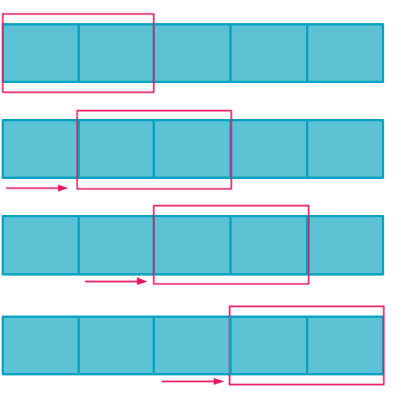
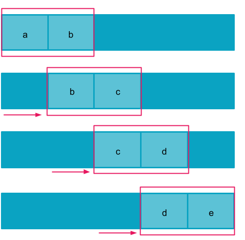
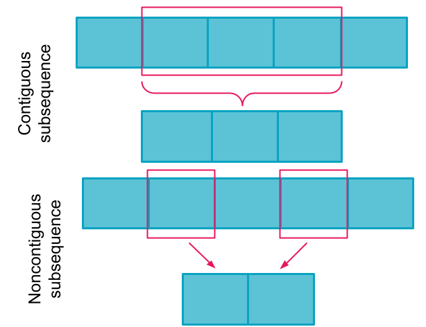
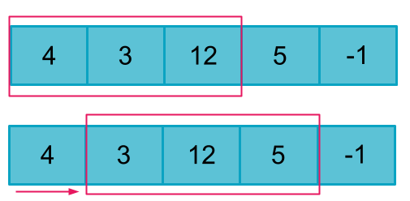
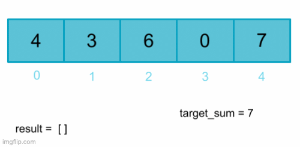
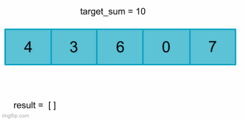
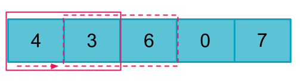

# Sliding Window Technique

## Overview

Within the broader category of dynamic programming, there are further techniques that can help us solve specific types of dynamic programming problems.

One useful strategy is called the **sliding window technique**. The sliding window technique is a strategy used to simplify time and space complexity when solving a problem that asks us to find some subsequence that satisifies a given set of conditions inside of a larger sequence.

## Understanding the Sliding Window Technique

Say we have some sequence of data that we want to examine. We can create a 'window' that allows us to look at some contiguous subsection of the data. Then, we then shift our window repeatedly in one direction so that we can look at every contiguous subsection one at a time. 

This is called the sliding window technique because it mimics sliding a window open or shut. The section of data we are currently viewing shifts as we slide our window along the sequence.

We can make our window as small or large as we would like to solve a problem, but we must be interested in looking at contiguous - meaning adjacent - subsections of the sequence. If we are interested in combining non-adjacent sections of the larger sequence into a subsequence, we need to use a different strategy. To accommodate noncontiguous subsequences, we would need to split our window and in most cases it would be difficult to know when we had examined all the subsequences we were interested in.

### When to Apply the Sliding Window Technique
What types of data can the sliding window technique be applied to? When deciding.

#### Contiguous Stream of Data
When determining whether the sliding window technique is an appropriate approach for a given problem, the first thing we want to consider is what type of data we will be looking at. Our input should be a contiguous, linear, and iterable set of data stored such that we can create a window over it.

For example, we could perform the sliding window technique on an array, because we can create a `window` variable that holds some subset of the data using list slicing.

In the example below, the input array is `arr = [4, 3, 12, 4, -1]`

Our window is initally `window = [4, 3, 12]` or `window = [0:2]`. If we use variables to store where the array slice should start and stop, each time we want to slide our window, all we need to do is increment each our start and stop variables by 1. 

We could do the same thing with a string using string slicing. In fact, most problems that can be will involve either a string or an array. 

It is also possible with some slight adjustments to perform the sliding window technique on a data structure such as a hashmap or a linked list, but accessing and storing values within the window may not be as straightforward because (at least in Python) we cannot slice a dictionary or linked list in the same way that we can a string or an array.

A data structure like a graph would be difficult to using the sliding window technique on, because it is not a linear data structure. How would we place and slide our window? 

#### Contiguous Subset
In order for the sliding window technique to be applicable, the problem must also ask us to find a contiguous subset of the problem.

For example, say you are given an array of integers and asked to find all adjacent pairs of integers in the list that add up to a given sum. This could be solved using the sliding window technique. Our window would be of size two and we can check each adjacent pair by starting the left end of the window at index 0 and shifting our window by one each iteration until the right end of the window is at the last index in the array.

However, if the problem were changed slightly and we were asked to instead find all  pairs of numbers in an array that add up to a given sum, adjacent or not, we could not use the sliding window technique. The elements we want to look at together wouldn't necessarily fit inside of a window.

#### Dynamic Programming Problem
Recall that the sliding window technique is used to solve a subset of dynamic programming problems. This means that problems solved with the sliding window technique should be optimization problems that maintain the optimal substructure property **and** have overlapping subproblems. 

The overlapping subproblems can be seen simply by observing the way we slide the window. Observe that when we shift the window in the array below, element 3 from the previous window is also in the new window. 

To determine whether the problem is composed of optimal substructures, consider whether the optimal overall solution is comprised of the optimal solution for its smallest subproblems for some sample inputs.

Some example questions we could solve with the sliding window technique include:
- [Given an array of integers, find the maximum sum subarray of a given size](https://www.geeksforgeeks.org/find-maximum-minimum-sum-subarray-size-k/)
- [Given an array of 0s and 1s, find the maximum sequence of continuous 1s that can be made by flipping at most k 0s to 1s](https://www.geeksforgeeks.org/find-zeroes-to-be-flipped-so-that-number-of-consecutive-1s-is-maximized/)
- [Given two strings, find the shortest substring in the first string that contains all the characters in the second string](https://leetcode.com/problems/minimum-window-substring/)

As always, there are some edge cases that may seem like sliding window problems but have other, more optimal solutions. However, in general, this is a good place to start. We will discuss at least one edge case in further detail later on in the lesson.

### Static Sliding Window

Now that we understand what the sliding window technique is, let's apply the technique to an example problem. 

### Dynamic Sliding Window

We can modify the sliding window technique by shifting the left and right edges of our windows at different rates. 

### Why can't Kadane's algorithm be solved with the sliding window technique?
- With a dynamically sized array, it isn't possible 

### Example - 