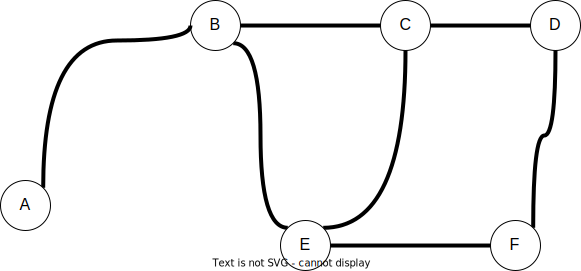

# Activity:  Graphs Activity 1

## Goal

Our goal is to be able to:

- Explain the different ways to represent graphs
- Describe breadth-first and depth-first searches
- Apply depth-first or breadth-first search to solving a coding problem

## Review Heaps Lesson

<!-- >>>>>>>>>>>>>>>>>>>>>> BEGIN CHALLENGE >>>>>>>>>>>>>>>>>>>>>> -->

### !challenge

* type: multiple-choice
* id: 04abaec0-1a2a-4d63-a8c9-1ea5b15b5ce9
* title: Match Graph to a list of edges
* points: 1
* topics: graphs

##### !question

Match the given graph to it's representation as a list of edges.


##### !end-question

##### !options

* `[ (0, 1), (0, 2), (1, 3), (1, 4), (2, 4), (3, 4)]`
* `[ (0, 1), (1, 0), (0, 2), (2, 0), (1, 3), (3, 1), (1, 4), (4, 1), (2, 4), (4, 2), (3, 4), (4, 3)]`
* `[ (0, 1), (0, 2), (1, 3), (1, 4), (2, 4)]`
* `[ (0, 1), (0, 2), (1, 3), (1, 4), (2, 1), (2, 4)]`


##### !end-options

##### !answer

* `[ (0, 1), (0, 2), (1, 3), (1, 4), (2, 4), (3, 4)]`

##### !end-answer

<!-- other optional sections -->
##### !hint

Count the number of edges.

##### !end-hint
<!-- !rubric - !end-rubric (markdown, instructors can see while scoring a checkpoint) -->
<!-- !explanation - !end-explanation (markdown, students can see after answering correctly) -->

### !end-challenge

<!-- ======================= END CHALLENGE ======================= -->

<!-- >>>>>>>>>>>>>>>>>>>>>> BEGIN CHALLENGE >>>>>>>>>>>>>>>>>>>>>> -->
<!-- Replace everything in square brackets [] and remove brackets  -->

### !challenge

* type: paragraph
* id: 14f60cd2-576f-49ec-9ddc-2e4a541869c9
* title: What would this graph look like as a 2D matrix?
* points: 1
* topics: python

##### !question

Write down a representation of the following graph as an *adjacency matrix*.


##### !end-question

##### !placeholder

How would you represent this graph as an adjacency matrix?

##### !end-placeholder

##### !explanation

We could do (using 1 for True and 0 for False):

```py
[
  [0, 1, 1, 0, 0],
  [1, 0, 0, 1, 0],
  [1, 0, 0, 1, 0],
  [0, 1, 1, 0, 1],
  [0, 0, 0, 1, 0],
]
```

##### !end-explanation

### !end-challenge

<!-- ======================= END CHALLENGE ======================= -->

<!-- >>>>>>>>>>>>>>>>>>>>>> BEGIN CHALLENGE >>>>>>>>>>>>>>>>>>>>>> -->
### !challenge

* type: paragraph
* id: 4230717c-93ac-4322-8fcd-00567b6df3e7
* title: What would this graph look like as a adjacency list?
* points: 1
* topics: python

##### !question

Write down a representation of the following graph as an *adjacency list*.


##### !end-question

##### !placeholder

How would you represent this graph as an adjacency list?

##### !end-placeholder

##### !explanation

We could do the following, with a Python dictionary

```py
{
 0: [1, 2],
 1: [0, 3],
 2: [0, 3],
 3: [1, 2, 4],
 4: [3],
}
```

##### !end-explanation

### !end-challenge

<!-- ======================= END CHALLENGE ======================= -->

<!-- >>>>>>>>>>>>>>>>>>>>>> BEGIN CHALLENGE >>>>>>>>>>>>>>>>>>>>>> -->
### !challenge

* type: multiple-choice
* id: ea4771f8-641c-4244-94be-22b73a7144f1
* title: BFS Time Complexity
* points: 1
* topics: graphs, depth-first-search, Big-O

##### !question

Below is a pseudocode for a Depth-First Search (BFS) algorithm.  What is the time complexity of this algorithm?

1. Starting with a graph's adjacency list and a starting node `s`
1. Create a Stack called `stack`
1. Create a list of nodes called `visited` and mark each element `false`
1. Push `s` into `stack`
1. mark `s` as `true` in `visited`
1. while `stack` is not empty
    1. Remove an element from `stack` and store it in `current_node`
    1. Loop through all the neighbors of `current_node`
        1. If they are not marked as `true` in `visited`
            1. Push the neighbor into `stack`
            1. Mark the neighbor as `true` in `visited`

Where `V` is the number of vertices (nodes) and `E` is the number of edges in the graph.

##### !end-question

##### !options

* O(V)
* O(V + E)
* O(V^2)
* O(VE)
* O(VE^2)

##### !end-options

##### !answer

* O(V + E)

##### !end-answer

##### !hint

With Depth-First-Search (DFS) in an undirected graph, we visit each node in the graph once and then we follow each edge twice, once to the node and then back.

Every node is added to the stack only once and we follow each each edge of all the nodes in the graph.

##### !end-hint

### !end-challenge

<!-- ======================= END CHALLENGE ======================= -->

<!-- >>>>>>>>>>>>>>>>>>>>>> BEGIN CHALLENGE >>>>>>>>>>>>>>>>>>>>>> -->
### !challenge

* type: multiple-choice
* id: 2cb66af7-92f8-44e0-b7c6-2900c6208478
* title: Breadth-First-Search
* points: 1
* topics: graphs, breadth-first-search

##### !question

Breadth First Search (BFS) has been implemented on the following Graph.  If BFS is called starting on node `A`, what is a possible order of visiting the nodes.



##### !end-question

##### !options

* ABCDFE
* ABCEDF
* FDECBA
* ABEFDC

##### !end-options

##### !answer

* ABCEDF

##### !end-answer

##### !hint

With breadth-first search, we visit a node in the graph and then each of it's neighbors followed by each of their neighbors and so on, only visiting each node once.

##### !end-hint

### !end-challenge

<!-- ======================= END CHALLENGE ======================= -->

### BFS Walkthrough

As a class lets follow breadth-first search on the following graph.


1. Start with a graph adjacency list and a specific node called `start_node`
1. Create a list of nodes called `visited` and mark each element `false`
1. Create an empty queue `q`
1. Add `start_node` to `q`
1. While `q` is not empty
    1. Remove an element from `q` and store it in `current`
    1. Mark `current` as `true` in the list `visited`
    1. Loop through each of `current`'s neighbors
        1. If the neighbor is not `true` in `visited` add it to `q`

### DFS Walkthrough

As a class lets follow breadth-first search on the following graph.


1. Starting with a graph's adjacency list and a starting node `s`
1. Create a Stack called `stack`
1. Create a list of nodes called `visited` and mark each element `false`
1. Push `s` into `stack`
1. mark `s` as `true` in `visited`
1. while `stack` is not empty
    1. Remove an element from `stack` and store it in `current_node`
    1. Loop through all the neighbors of `current_node`
        1. If they are not marked as `true` in `visited`
            1. Push the neighbor into `stack`
            1. Mark the neighbor as `true` in `visited`

**Question**:  Can DFS help us identify a cycle?

## Livecode - Project Introduction

As a class we will check out  the [project](./graphs.checkpoint.md).  We will only review the project assignment.  The purpose is to gain familiarity with the project and to discuss how to implement either BFS or DFS.

### !callout-star

## Interviews Alert!

Breadth-First-Search & Depth-First-Search are among the most common topics in interview questions for fulltime positions.  You can use either strategy to solve this week's project.

### !end-callout

### Leetcode Style Question

In the next activity we will try solving a coding solution using BFS.

- [Course Schedule](https://replit.com/@ChrisMcAnally/Course-Schedule)

This is a typical type of interview question where you need to identify if there are any cycles in a graph.  This problem is using a technique called, [Graph Labeling](https://en.wikipedia.org/wiki/Graph_labeling) to identify if there are cycles in the graph.  Once we encounter a node on a DFS traversal we label it with a "color," if deeper in the traversal, we encounter a node with that color we have a cycle.

This same kind of technique can be applied to the project.

## Optional Exercise

Time may not allow for this activity, but it is a good opportunity to practice a graph traversal

### !callout-secondary

## Suggestion:  Start The Project Now

It can be a *really* good idea to start the project with classmates and instructional staff around to ask questions of. Getting a solid start to a project makes the entire thing go easier.

### !end-callout